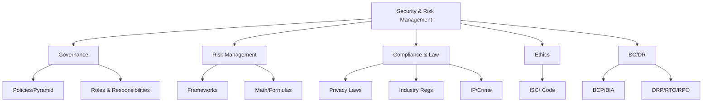

# Domain 1 - Security and Risk Management

## Feynman Explanation

A company's information security program is like the safety systems on an airplane: it is not a single gadget but a stack of rules, people, math, and laws that all have to work together. This domain is the "why we do security" layer — the rules of the road, the math we use to decide which risks matter, the laws we must obey, the ethics we promise to follow, and the plans we keep on the shelf in case something terrible happens. If you skip this domain, the rest of security is just expensive tools with no business reason behind them.

## Technical Details

### Domain 1 in the (ISC)² CISSP 2024 Outline

Domain 1 carries the largest weight on the exam (historically ~15%, with the 2024 refresh still emphasizing it as the "managerial" domain). It is the only domain that explicitly tests governance, ethics, and law.

| Subdomain | Topic | Weight (approx) |
|---|---|---|
| 1.1 | Professional Ethics (ISC² Code of Ethics) | High |
| 1.2 | Security Concepts (confidentiality, integrity, availability, authenticity, non-repudiation) | High |
| 1.3 | Security Governance (policies, standards, procedures, guidelines) | High |
| 1.4 | Legal, Regulatory, and Compliance Issues | High |
| 1.5 | Investigation Types (operational, criminal, civil, regulatory, eDiscovery) | Medium |
| 1.6 | Security Policies, Procedures, Standards, and Guidelines | High |
| 1.7 | Business Continuity and Disaster Recovery | High |

### Core Concepts Map



### The CIA Triad + Parkerian Hexad

| Model | Properties | Source |
|---|---|---|
| CIA Triad | Confidentiality, Integrity, Availability | Classic |
| Parkerian Hexad | CIA + Authenticity, Possession/Utility, Non-Repudiation | Donn Parker, 1990s |
| AAA | Authentication, Authorization, Accountability | Modern access model |
| STRIDE | Spoofing, Tampering, Repudiation, Information Disclosure, DoS, Elevation of Privilege | Microsoft threat model |

### Risk Management Lifecycle

1. **Identify** assets, threats, vulnerabilities
2. **Assess** likelihood and impact
3. **Mitigate / Treat** (avoid, transfer, accept, mitigate)
4. **Monitor & Review** continuously
5. **Communicate** with stakeholders

### The 4 Risk Responses

| Response | Definition | Example |
|---|---|---|
| Avoid | Stop doing the risky activity | Disable a vulnerable service |
| Transfer | Shift to a third party | Cyber insurance, outsourcing |
| Mitigate | Reduce likelihood or impact | Patch, MFA, encryption |
| Accept | Acknowledge and document | Risk register sign-off |

### Due Care vs Due Diligence

- **Due Care** = acting responsibly (the steps you take).
- **Due Diligence** = ensuring those steps are actually effective (the verification).
- A CISO can be charged with negligence for *not* doing due diligence on a known gap.

### Key Exam Themes

- Vocabulary precision (confidentiality vs privacy; threat vs vulnerability; policy vs standard)
- Defense in depth, least privilege, separation of duties, need-to-know
- "Which document is highest in the hierarchy?" → **Policy** (always at the top)
- Always pick the **business-driven** answer on management questions

<!-- EXPANDED -->
## Foundations

A 10-year CISO thinks in **risk as currency**. Every technical control is a bet denominated in dollars of loss reduction. The CISO's mental models:

- **Risk is a business input, not a security output.** If you cannot state the top 5 risks in terms the CFO tracks (revenue, margin, regulatory exposure), you are not managing risk — you are managing vulnerabilities.
- **The policy pyramid is contractual infrastructure.** A policy signed by the CEO is a legally enforceable standard of care. An unsigned policy is a draft. This distinction matters in court, in audits, and in boardrooms.
- **Compliance $\neq$ security, but compliance failures are existential.** You can be PCI-compliant and still breached, but losing MATCH-listed merchant status kills the business faster than any breach.
- **Authority flows from the charter.** A CISO without a signed security charter is an advisor, not an officer. The charter establishes the reporting line, budget authority, and the right to say "no" to the CEO — [[security-governance-policies-standards]] details this.

| Mental Model | What a Junior Analyst Asks | What a CISO Asks |
|---|---|---|
| Risk | "Is this vulnerability critical?" | "What is the ALE of this risk class across our entire portfolio?" |
| Compliance | "Are we PCI compliant?" | "What is our exposure if our QSA finds a gap — fines, MATCH, or both?" |
| Governance | "Do we have a policy for this?" | "Can I produce this signed policy in discovery within 72 hours?" |
| BC/DR | "Do our backups work?" | "What is the cost-per-hour of downtime for our top 3 revenue systems?" |

<!-- EXPANDED -->
## Architecture

### The Governance-Risk-Compliance-BC/DR Interlock

Governance, risk, compliance, and BC/DR are not four separate programs — they are a single control loop:

```
Governance (charter, policy pyramid, board authority)
    ↓ sets
Risk Appetite → Risk Register (top N threats + ALE per threat)
    ↓ drives
Control Selection → mapped to regulatory requirements (compliance)
    ↓ validated by
BC/DR Testing → tabletop exercises, RTO/RPO achievement rates
    ↓ feeds back to
Board Risk Committee → adjusts appetite, budget, charter
```

**Architectural principle:** The Authorizing Official (AO) is the single most under-leveraged governance role. In NIST RMF, the AO is a business executive — not the CISO — who signs the ATO. The AO carries **personal liability** for accepting residual risk. A mature CISO ensures the AO receives quarterly briefings with explicit risk acceptance forms, retained for 7+ years. This signature trail is the CISO's strongest legal shield.

### Security Organization Design

| Model | Reporting Line | When to Use |
|---|---|---|
| **CISO → CIO** | CISO reports to CIO | Default; CIO controls budget; risk of conflict (CIO wants ship-it, CISO wants secure-it) |
| **CISO → CEO** | CISO reports directly to CEO | Mature orgs; elevated authority; risk of being frozen out of day-to-day IT decisions |
| **CISO → CFO / Legal** | CISO under finance or GC | Regulated industries (finance, healthcare); compliance-first; less technical influence |
| **CISO → Board Risk Committee** | Dotted or solid line to board | Maximum independence; most defensible in litigation; hardest to achieve politically |

**The CISO regaining board authority:** The CSF 2.0 **Govern** function explicitly places cybersecurity risk governance at the board level. A CISO can use CSF 2.0's Govern function as leverage: "The NIST framework used by our regulators requires board-level cybersecurity risk oversight. I need 15 minutes quarterly on the audit committee agenda."

<!-- EXPANDED -->
## Execution

### Building a Risk Register (the 10-minute version)

1. **Identify 10-20 risk scenarios** — cross-reference threat intelligence, incident history, and BIA criticality tiers.
2. **Score each on a 5×5 matrix** — likelihood (1-5) × impact (1-5) → 25-cell heat map. Qualitative first, quantitative for top-tier.
3. **Compute ALE for top 5:** $SLE = AV \times EF$, $ALE = SLE \times ARO$. See [[risk-formulas-and-quantitative-analysis]].
4. **Assign risk owner** — a named VP, not a department. "Engineering" cannot accept risk; the VP of Engineering can.
5. **Document treatment decision** — avoid / transfer / mitigate / accept, with a dated signature.
6. **Review quarterly** — stale risk registers are audit findings, not governance artifacts.

### Running a BIA (Business Impact Analysis)

The BIA is the **single most important artifact** in BCP — [[business-continuity-and-disaster-recovery]]. Steps:
1. Identify critical business functions (tier 1-4).
2. Map function → system dependency → vendor dependency.
3. Establish MTPD → RTO → RPO per function. **RTO/RPO are business decisions, not IT decisions.**
4. Calculate downtime cost per hour: $Direct\ loss + Secondary\ loss$ (regulatory fines, reputational).
5. Match recovery strategy to cost: hot site for $M/hour functions, warm/cold for lower tiers.

### Risk Response Decision Framework

| Condition | Response | Because |
|---|---|---|
| $ALE > 5\% \times Annual\ Revenue$ and no viable mitigation | **Avoid** | Existential; stop the activity |
| $ACS > 0$ (control cost < risk reduction) | **Mitigate** | Positive ROI; see [[risk-formulas-and-quantitative-analysis]] |
| $ACS < 0$ but compliance-mandated | **Mitigate** | Not optional; separate budget line for compliance |
| Low-frequency, high-magnitude, beyond organizational capacity | **Transfer** | Cyber insurance; ensure policy covers the specific scenario |
| $ALE < Cost\ of\ Documentation$ | **Accept** | Document, sign, review annually; don't over-engineer |

### Board-Ready Policy Template

A board-ready policy fits one page: (1) Purpose, (2) Scope, (3) Policy statement (3-5 bullet "must" rules), (4) Roles & responsibilities, (5) Exceptions process, (6) Enforcement clause, (7) CEO signature block and date. If it needs more than one page, split it into a policy (board) + standard (engineering). See [[security-governance-policies-standards]].

<!-- EXPANDED -->
## Mastery

### Quantitative Risk Aggregation (Enterprise Scale)

Aggregating ALE across an enterprise is not a sum — risks are correlated. A ransomware event affecting all Windows servers simultaneously is one threat with $N$ affected assets, not $N$ independent risks.

$$Portfolio\ ALE = \sum_{i=1}^{n} (SLE_i \times ARO_i) - Correlation\ Overlap$$

The correlation overlap is the hard part. The most common failure: summing independent ALEs and claiming "total risk = $X$," when a single event (cloud provider outage, ransomware worm) triggers multiple risks simultaneously.

### Monte Carlo Simulation

FAIR-based Monte Carlo replaces point estimates with probability distributions. Instead of "ALE = $7.5M," the output is "90% confidence: annual loss between $4.2M and $9.8M, with a 5% tail risk above $12M." This is what cyber insurers and CFOs actually consume. Tooling: OpenFAIR, RiskLens, homegrown Python/SciPy. See [[risk-management-frameworks]].

### Risk Maturity Modeling (CMMI-Based)

| Level | Name | Characteristics |
|---|---|---|
| 1 | **Initial** | Ad-hoc, hero-driven, no documented process. Risk = whoever yells loudest. |
| 2 | **Managed** | Basic risk register exists; qualitative heat maps; annual assessment. |
| 3 | **Defined** | Quantitative top-tier risks; policy pyramid documented; board reviews quarterly. |
| 4 | **Quantitatively Managed** | FAIR/Monte Carlo for top 10 risks; KRIs tied to risk appetite; automated control monitoring. |
| 5 | **Optimizing** | Continuous risk quantification; predictive analytics; risk-informed capital allocation. |

Most Fortune 500 CISOs operate at Level 2-3. Level 4-5 requires dedicated risk analytics teams.

### Risk Appetite → Cyber Insurance Coverage

$$Coverage\ Limit = Appetite\ Threshold \times 1.5\ (buffer)$$

If the board's stated risk appetite is "no single event exceeding $20M impact," cyber insurance should cover at least $30M with sub-limits matching top threat categories (ransomware, business interruption, regulatory defense). The insurance policy's exclusions (act of war, state-sponsored, failure to maintain controls) must be mapped to the risk register — a risk classified as "transferred" without verifying policy coverage is an accepted risk in disguise.

<!-- EXPANDED -->
## Resilience

### Common CISO Mistakes

| Mistake | Why It Fails | Fix |
|---|---|---|
| **Too many risks in the register** | 200 risks = 0 risks managed. Board tunes out after page 3. | Top 10-15, classified by ALE. The rest go in an operational backlog. |
| **No business context** | "Critical vulnerability in Apache" means nothing to a board. | "Vulnerability in our payment processing pipeline = $2.4M ALE, RTO impact: 8 hours." |
| **Wrong metrics** | "99.9% patch rate" is a security metric. The board wants: "risk reduced from $X to $Y." | Map every technical metric to a risk-dollar equivalent. |
| **Solo BCP author** | One person writes the BCP, nobody else knows it exists. | Cross-functional BCP committee; tabletop exercises force shared ownership. |
| **Treating qualitative as final** | "High/Medium/Low" cannot survive a CFO's budget challenge. | Qualitative to triage, quantitative for budget defense. |

### Pitfalls in Risk Quantification

- **Garbage-in, garbage-out ARO.** Nobody knows the true annual rate of a sophisticated APT attack. Use ranges, not point estimates. Monte Carlo with wide distributions is more honest than a precise ARO with no basis.
- **Ignoring secondary loss.** The $2,000 laptop is the primary. The GDPR fine, customer churn, and stock price drop are the secondary — often 10-100× larger. FAIR's $LM = PL + SL$ forces this conversation.
- **Confusing precision with accuracy.** ALE = $7,523,412.19 is less credible than "between $5M and $10M." Round to the nearest meaningful unit.

### When Qualitative Beats Quantitative

Qualitative wins when: (1) The asset has no clear dollar value (reputation, employee morale, future M&A leverage). (2) The threat frequency is genuinely unknowable (novel attack class, zero-day with no precedent). (3) The cost of data collection exceeds the value of precision (low-tier risks, startup with no historical incident data). Use qualitative for triage and low-tier; reserve quantitative for budget defense and cyber insurance.

### What Fails in Real BCP Exercises

- **People don't know their roles.** The BCP names "Incident Commander" but the person has never practiced. Tabletop exercises fail when the CFO discovers they're supposed to authorize a $2M emergency spend.
- **Succession plans are outdated.** The named successor left the company 18 months ago. The root password was in their personal vault.
- **Vendor dependencies are invisible.** The BCP assumes a hot site but the hot site provider also uses the same cloud region that just went down.
- **Communication plans are theoretical.** "We'll notify customers within 72 hours" — but legal, PR, and the SOC disagree on who drafts the message. The first hour of a real incident is spent negotiating authority, not executing recovery.

<!-- EXPANDED -->
## Context

### Framework Selection: ISO 27001 ISMS vs NIST CSF vs COBIT

| Framework | A CISO Picks It When... | Don't Pick It When... |
|---|---|---|
| **ISO 27001** | Customers demand a certifiable ISMS; EU/global contracts require it; supply chain RFPs ask for ISO cert | You need lightweight, operationally-focused guidance; you cannot sustain annual surveillance audits |
| **NIST CSF 2.0** | You need a board-ready, all-sectors program framework; US-regulated; you want the 6-function structure (Govern/ID/PR/DE/RS/RC) | You need a certifiable standard (CSF is a framework, not a certification); you need prescriptive control-by-control guidance |
| **COBIT 2019** | You're aligning IT governance with enterprise governance (EDM/APO/BAI/DSS/MEA); IT is a shared service across business units | You need a security-specific framework; you're a small/mid org without a mature enterprise governance structure |
| **NIST RMF (800-37)** | You're a US federal agency or contractor; you need system-level ATOs; FedRAMP compliance | You're a small private company; you don't have dedicated security assessors |
| **FAIR** | You need board-ready dollar-denominated risk; cyber insurance underwriting requires probabilistic loss estimates | You only need qualitative triage; you cannot invest in data collection and modeling |

**The CISO's actual playbook:** Adopt NIST CSF 2.0 as the enterprise program framework → map ISO 27001 Annex A controls to CSF subcategories for certification → use COBIT EDM for board governance alignment → deploy FAIR for top-10 risk quantification → run NIST RMF per-system for regulated systems. One primary, others mapped.

### Small Company vs Enterprise Governance

| Aspect | Startup / SMB (< 200 employees) | Enterprise / Regulated |
|---|---|---|
| Policy | 1-page InfoSec Policy + AUP; CEO signs both | Full pyramid: 10-15 policies + standards + procedures + baselines |
| Risk register | Top 5-8 risks, qualitative heat map, Google Sheets | Top 15-20 risks, quantitative FAIR for top-tier, GRC platform |
| Compliance | SOC 2 Type II or ISO 27001 (customer-driven) | Multi-framework: SOX, PCI, HIPAA, GDPR, FedRAMP, ISO |
| BC/DR | Cloud DRaaS, one tabletop/year, documented runbooks | Tiered recovery (hot/warm/cold), semi-annual tabletops, cross-functional BCP committee |
| Board reporting | Quarterly 5-slide deck: top risks + status | Formal risk committee, KRIs, quarterly AO briefings, signed acceptance |
| Staffing | CISO is also the SOC lead, GRC lead, and incident commander | CISO + dedicated GRC + BCP + risk analytics + SOC manager |

**When to skip frameworks:** A 30-person SaaS startup does not need COBIT or NIST RMF. SOC 2 + a 5-risk heat map + cloud DR runbooks is sufficient. Frameworks are compounding interest — worthless early, priceless at scale.

<!-- EXPANDED -->
## Nuance

### Due Care vs Due Diligence — The Legal Distinction

In court, **due care** is the reasonable person standard — "would a reasonable CISO have had a policy for this?" **Due diligence** is the verification — "did the CISO test that policy and document the results?" The prosecution's first question: "Show me your last risk assessment." If the answer is "we didn't do one," the due care argument collapses because diligence was never attempted. If the answer is "here it is, dated, signed, reviewed quarterly," the CISO has a defensible position.

**The Authorizing Official's hidden liability:** Under NIST RMF, the AO is a named individual — typically a CIO, CFO, or COO — who signs the ATO. If a breach occurs and the AO signed an ATO without understanding the residual risk, the AO can be personally named in shareholder derivative suits and regulatory enforcement actions. The CISO's job is to ensure the AO *cannot claim ignorance* — every ATO package includes a 1-page risk acceptance memo, in plain language, signed by the AO.

### Transborder Data Flow Complexities

A single customer record in a US SaaS company with EU customers can implicate: GDPR (EU residency), CCPA/CPRA (California residency), PIPL (if the data transits China), and local data localization laws (Russia, India, Vietnam). Post-Schrems II (2020), EU → US data transfers require Standard Contractual Clauses (SCCs) + Transfer Impact Assessment (TIA). The EU-US Data Privacy Framework (DPF, 2023) created a new adequacy mechanism, but legal challenges from privacy advocates continue. The CISO's pragmatic response: maintain SCCs as the primary mechanism, register under DPF as secondary, and document the TIA. See [[gdpr-deep-dive]].

### "Reasonableness" as a Legal Standard

US common law, SEC cyber disclosure rules, and FTC enforcement actions all center on **reasonableness** — not perfection. "Reasonable security" is what a similarly-situated organization would do given the same threat landscape, data sensitivity, and available resources. This is why framework adoption (NIST CSF, ISO 27001) is so powerful in court: it establishes an industry-recognized baseline of reasonableness. Conversely, a company that *ignores* the framework its peers use is per se unreasonable.

**⚠️ CONFLICT:** NIST CSF 2.0 (DOI 10.6028/NIST.CSWP.29, February 2024) added the **Govern** function — 6 functions total — which is a structural upgrade over CSF 1.1's 5 functions. Original content references CSF generically. CSF 2.0 explicitly elevates cybersecurity risk to board-level governance, cross-cutting supply chain risk management, and workforce management (NIST SP 1308).

<!-- EXPANDED -->
## Resources

### CISO Decision Checklist (Quarterly)

- [ ] Risk register reviewed, top 10 risks updated with current ALE ranges
- [ ] Risk appetite re-affirmed or adjusted by board
- [ ] AO briefing conducted; risk acceptance forms signed and archived
- [ ] Policy exceptions reviewed — any open > 90 days escalated
- [ ] BCP tabletop exercise completed within last 6 months
- [ ] Cyber insurance policy reviewed — exclusions mapped to risk register
- [ ] Vendor criticality tiers updated — new vendors risk-assessed
- [ ] Compliance calendar confirmed — audits, scans, training, filings
- [ ] Security charter re-affirmed by executive sponsor
- [ ] Annual security report delivered to board

### Risk Appetite Statement Template

> **Risk Appetite Statement — [Company Name] — [Year]**
>
> 1. The organization accepts risk up to **$[X]M** in annual aggregate loss exposure from information security events.
> 2. No single event shall exceed **$[Y]M** in total impact (primary + secondary).
> 3. Risks exceeding these thresholds must be **transferred** (cyber insurance, contractual indemnification) or **avoided** (cessation of activity).
> 4. This statement is reviewed annually by the Board Audit Committee. Any residual risk exceeding appetite must be formally accepted by the Authorizing Official with a signed memorandum retained for 7 years.
> 5. Cyber insurance coverage limits shall equal **1.5×** the single-event threshold with sub-limits for ransomware, business interruption, and regulatory defense.

### Key Frameworks Quick-Reference

| Framework | Type | Certifiable? | Best For | Primary Output |
|---|---|---|---|---|
| NIST CSF 2.0 | Enterprise program | No (framework) | All orgs, board-level governance | 6-function maturity profile |
| NIST RMF (800-37) | System lifecycle | No (process) | US federal, regulated industries | ATO package |
| ISO/IEC 27001:2022 | Management system | **Yes** | Global, customer/partner-driven | ISMS certificate |
| ISO/IEC 27005:2022 | Risk methodology | No (guidance) | ISO 27001 orgs | Risk treatment plan |
| COBIT 2019 | IT governance | No (framework) | Enterprise IT alignment | Goals cascade, maturity |
| FAIR (Open Group) | Quantitative risk | **Yes** (certification) | Board reporting, insurance | Dollar-denominated risk |
| CIS Controls v8 | Controls catalog | No (standard) | Implementation prioritization | IG1/IG2/IG3 maturity |
| PCI-DSS 4.0 | Industry standard | **Yes** (QSA audit) | Card payment environments | ROC / AOC |
| SOC 2 (AICPA) | Trust services | **Yes** (CPA audit) | Service orgs, SaaS | SOC 2 Type II report |

## CISO / Risk Manager View

From the boardroom, Domain 1 is the language we use to translate "bad things that could happen" into "decisions we can defend in court, to regulators, and to shareholders." Every other technical domain (domains 2-8) is an *output* of Domain 1 decisions:

- We deploy MFA (Domain 5) **because** the risk register showed credential theft as the top threat (Domain 1).
- We run tabletop exercises (Domain 7) **because** the BCP requires annual validation (Domain 1).
- We refuse a vendor's request to log PII in plaintext (Domain 2) **because** GDPR Article 5 says we cannot (Domain 1).

**Risk appetite** is the single most important board-level conversation in this domain. A CISO's job is to:
1. Quantify the top 5-10 risks in dollar terms.
2. Show the board the gap between current spend and required control investment.
3. Get explicit acceptance (with signature) for any residual risk above the board's stated appetite.

Without that signature trail, the CISO carries personal liability.

## Related Connections

### L2 - Deep-dive Models/Frameworks
- [[risk-management-frameworks]] - NIST RMF, ISO 27005, COBIT, OCTAVE, FAIR
- [[risk-formulas-and-quantitative-analysis]] - ALE, SLE, ROSI, FAIR math
- [[security-governance-policies-standards]] - Policy pyramid, charters
- [[legal-regulatory-compliance-landscape]] - GDPR, HIPAA, SOX, GLBA, PCI-DSS, FedRAMP, FISMA
- [[business-continuity-and-disaster-recovery]] - BCP/DRP, BIA, RTO/RPO/MTPD

### L3 - Regulations/Edge cases
- [[gdpr-deep-dive]] - Articles 5, 17, 25, 32, 33
- [[hipaa-security-rule]] - Administrative/Physical/Technical safeguards
- [[pci-dss-4-0]] - 12 requirements, SAQ types
- [[isc2-code-of-ethics]] - 4 canons

### Cross-Domain Links
- [[domain-02-asset-security]] - Asset classification flows from governance policy
- [[domain-03-security-architecture-and-engineering]] - Control selection driven by risk treatment decisions
- [[domain-05-identity-and-access-management]] - Least privilege is a Domain 1 principle implemented here
- [[domain-07-security-operations]] - BCP/DR procedures live in ops; ops inherits the framework
- [[domain-08-software-development-security]] - SDLC policy lives in Domain 1

## Sources / References

- (ISC)² CISSP Certified Information Systems Security Professional Official Study Guide, 9th/10th Ed.
- (ISC)² CISSP Common Body of Knowledge (CBK), 2024 update
- NIST SP 800-39 - Managing Information Security Risk
- ISO/IEC 27001:2022 / 27005:2022
- COBIT 2019 - ISACA
- FAIR Standard - The Open Group
- NIST Cybersecurity Framework (CSF) 2.0 - DOI 10.6028/NIST.CSWP.29, February 2024
- NIST SP 800-37 Rev. 2 - Risk Management Framework
- NIST SP 800-34 Rev. 1 - Contingency Planning Guide
- NIST SP 1308 - CSF 2.0 Workforce Management Quick-Start Guide
- Regulation (EU) 2016/679 (GDPR)
- 45 CFR Parts 160, 162, 164 (HIPAA)
- PCI-DSS v4.0 - PCI Security Standards Council
- (ISC)² Code of Ethics
- Douglas W. Hubbard - "How to Measure Anything in Cybersecurity Risk"
- Jack Jones - "Measuring and Managing Information Risk: A FAIR Approach"
- Schrems II - Case C-311/18, Court of Justice of the EU (2020)
- ISACA COBIT 2019 Framework
