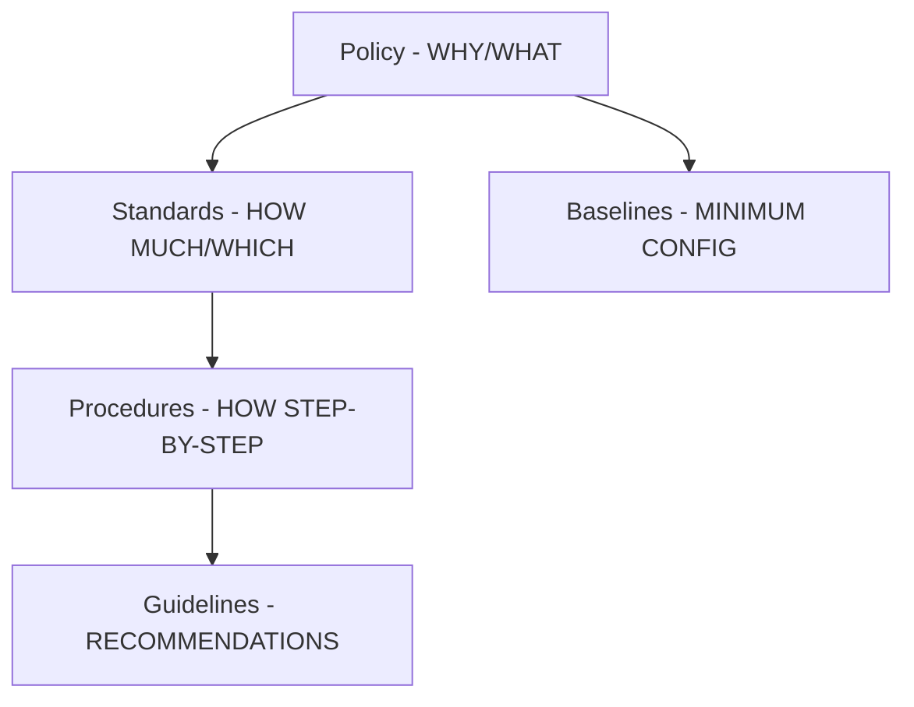

# Security Governance — Policies, Standards, Procedures, Guidelines

## Feynman Explanation

A policy tells people *what* to do. A standard tells them *how much / which one*. A procedure tells them *how step by step*. A guideline tells them *what we recommend, use your judgment*. Without this hierarchy, a company ends up with 200 documents that all say different things, and an auditor walks in and finds the front door open. The hierarchy is also a legal shield: the policy is signed by executives and becomes the "reasonable standard of care" you can show the court.

## Technical Details

### The Pyramid (Top = Authority)

| Layer | Audience | Mandatory? | Example |
|---|---|---|---|
| **Policy** | All employees, executives | Yes - mandatory | "All laptops must be encrypted" |
| **Standard** | Engineers, admins | Yes - mandatory | "Approved algorithms: AES-256-GCM, RSA-2048+" |
| **Baseline** | Engineers, admins | Yes - mandatory | "Windows laptop image includes BitLocker + TPM + Secure Boot" |
| **Procedure** | Operators | Yes - mandatory | "Step 1: open BitLocker mgmt console..." |
| **Guideline** | Practitioners | No - advisory | "We recommend using 1Password over browser password managers" |

### Policy (Top of the Pyramid)

- **Purpose:** state management's intent and direction.
- **Length:** short — typically 1-3 pages.
- **Tone:** high-level, non-technical, written in business terms.
- **Lifecycle:** rarely changes, approved by C-suite / board.
- **Examples:** Information Security Policy, Acceptable Use Policy (AUP), Email Policy, BYOD Policy, Data Classification Policy, Incident Response Policy, BCP/DR Policy, Password Policy, Encryption Policy, Vendor Risk Management Policy, etc.

**Exam tip:** When asked "which document is highest in the hierarchy?" the answer is *always* policy.

### Standard

- **Purpose:** translate policy into measurable, enforceable requirements.
- **Length:** longer, detailed.
- **Examples:** Cryptographic Standard (which algorithms and key lengths), Network Standard (which protocols are permitted), Authentication Standard (MFA required for all admin access), Data Retention Standard (7 years for financial records).

### Baseline

- A **minimum** configuration or set of controls that must be applied.
- Examples: CIS Benchmarks, DISA STIGs, vendor-recommended hardening guides.
- Baselines are a *floor*, not a *ceiling*.

### Procedure

- **Purpose:** the step-by-step "how" of a specific task.
- Length: can be long (e.g., 30 pages for incident response).
- **Examples:** "How to onboard a new employee," "How to image a laptop," "How to revoke access upon termination," "How to apply a patch in production."

### Guideline

- **Purpose:** recommendations, best practices, *not* mandatory.
- Tone: "we recommend..."
- Examples: Secure coding guidelines, secure email usage guidelines.

### Acceptable Use Policy (AUP)

Special category of policy that defines what users are and are not allowed to do with company resources. Must be:

- Signed by every employee (and contractor) before access is granted.
- Reviewed annually.
- Specific enough to enforce (e.g., "no personal cloud storage for company data") but not so rigid it becomes unenforceable.

### Charter

- Establishes the **authority, mission, scope, and reporting line** of the security function.
- One of the most important documents in the program.
- Signed by executive sponsor and ideally the board.
- Grants the CISO the authority to enforce policies, conduct audits, and report risk upward.

**Exam trap:** A CISO without a charter is a CISO without authority. If an incident happens, the charter is the document that proves the security function was *mandated*, not optional.

### Supporting Governance Documents

| Document | Purpose |
|---|---|
| Security Charter | Authority of the security function |
| Risk Register | Top risks, owners, treatment, status |
| Statement of Applicability (SoA) | ISO 27001 control applicability |
| Security Awareness & Training Plan | Education cadence |
| Audit Charter | Authority of internal audit |
| Service Level Agreements (SLAs) | Security commitments to internal/external customers |

### People and Roles

| Role | Responsibility |
|---|---|
| Board / Audit Committee | Ultimate governance |
| CISO | Security program owner |
| Data Owner (often business VP) | Classifies data, decides protection level |
| Data Custodian / Steward | Implements protection (IT, security ops) |
| System Owner | Single accountable person for a system |
| User | Follows policies, reports incidents |

**Critical exam concept:** *The data owner is the business executive, not IT.* IT implements what the business decides.

### Separation of Duties (SoD) and Least Privilege

- **Separation of Duties:** no single person should control an entire critical process. Classic example: a single person cannot request, approve, and pay an invoice.
- **Least Privilege:** every user gets the *minimum* rights needed to do their job, for the *minimum* time.
- **Need-to-Know:** a stricter form of least privilege, used for classified information.
- **Two-Person Rule (Two-Person Integrity):** certain critical actions require two authorized people.

### Due Care vs Due Diligence (Recap)

- **Due Care** — the policies and standards exist; reasonable steps are documented.
- **Due Diligence** — the policies are actually being followed; audits, tests, and reviews prove it.

A company can be found negligent for having a great policy (due care) but never testing it (failed due diligence).

## CISO / Risk Manager View

**Board-level best practice — the "5 governance artifacts" the CISO must always have current:**

1. **Security Charter** — defines the CISO's authority; signed by the CEO or board.
2. **Information Security Policy** — one page, signed by the CEO, posted on the intranet.
3. **Risk Register** — single source of truth for the top 10-20 risks; reviewed quarterly with the board.
4. **Acceptable Use Policy** — signed by every employee, every contractor, every year.
5. **Annual Security Report** — risk posture, control effectiveness, incidents, maturity, roadmap.

**Tactical advice:**

- **Don't write policies nobody reads.** A 100-page policy nobody signs is worse than a 1-page policy everyone signs.
- **Tie policies to controls.** Every policy clause should map to at least one control in the risk register, otherwise it is decoration.
- **Annual review is non-negotiable.** Stale policies are inadmissible in court. The reviewer must be named.
- **Make policy exceptions explicit.** When a business unit says "we can't follow the encryption policy," the answer is a documented, time-bound, signed exception — not silence.

**What auditors look for first:** the policy hierarchy. If they walk in and there is no policy → standards → procedure chain, the entire program is suspect.

## Related Connections

### Sibling L2
- [[risk-management-frameworks]] - Frameworks (NIST, ISO) require this hierarchy
- [[legal-regulatory-compliance-landscape]] - Compliance mandates the policy structure
- [[business-continuity-and-disaster-recovery]] - BCP/DR Policy and Procedures live here
- [[risk-formulas-and-quantitative-analysis]] - Risk acceptance is signed at the policy level

### L3
- [[hipaa-security-rule]] - HIPAA's three safeguard categories map to the policy pyramid
- [[pci-dss-4-0]] - PCI-DSS Requirement 12 is essentially the policy mandate

### Cross-Domain
- [[domain-05-identity-and-access-management]] - Least privilege is a Domain 1 principle, implemented here
- [[domain-07-security-operations]] - Procedures live in ops
- [[domain-08-software-development-security]] - Secure SDLC policy and coding guidelines live here

## Sources / References

- NIST SP 800-12 Rev. 1 - An Introduction to Information Security
- NIST SP 800-100 - Information Security Handbook: A Guide for Managers
- ISO/IEC 27002:2022 - Information security, cybersecurity and privacy controls
- COBIT 2019 - Governance and Management Objectives
- PCI-DSS v4.0 Requirement 12 - Maintain a policy that addresses information security for all personnel
- (ISC)² CISSP CBK, 2024
- SANS Security Policy Templates - https://www.sans.org/information-security-policy/
