# Domain 5 - Identity and Access Management (IAM)

## Feynman Explanation

Identity and Access Management is the security discipline that answers two questions for every request: **"Who are you?"** (authentication) and **"Are you allowed to do that?"** (authorization). It is the front door, the badge reader, the visitor log, and the key cabinet of the enterprise. If the network is a building, IAM is everything that decides which human (or service) may walk through which door, at what time, and with what tools. Get IAM wrong and every other control — firewalls, encryption, DLP, SIEM — is just an expensive lock protecting nothing, because attackers walk in as legitimate users.

## Technical Details

### Domain 5 in the (ISC)² CISSP 2024 Outline

Domain 5 carries ~13% of the exam weight. It is the only domain that is operationally about *people* (and the digital identities that represent them) rather than about *data*, *code*, or *networks*.

| Subdomain | Topic | Exam Weight (approx) |
|---|---|---|
| 5.1 | Identification, authentication, authorization (AAA) | High |
| 5.2 | Physical and logical access control | High |
| 5.3 | Identity and access provisioning lifecycle | High |
| 5.4 | Authentication factors and mechanisms (MFA, passwordless, FIDO2) | High |
| 5.5 | Federated identity (SAML, OIDC, OAuth 2.0, WS-Fed) | High |
| 5.6 | Access control models (DAC, MAC, RBAC, ABAC, rule-based) | High |
| 5.7 | Session management, registration, proofing | Medium |
| 5.8 | Threat modeling for IAM (credential theft, MFA fatigue, lateral movement) | Medium |
| 5.9 | Zero Trust, SDP, microsegmentation, continuous verification | High (new in 2024) |

### Core Concepts Map

```mermaid
graph TD
    IAM[Identity and Access Management] --> ID[Identification]
    IAM --> AUTHN[Authentication]
    IAM --> AUTHZ[Authorization]
    IAM --> ACCT[Accountability / Auditing]
    ID --> ID1[Subject - user, service, device]
    AUTHN --> A1[Knowledge - password, PIN]
    AUTHN --> A2[Possession - token, smart card, phone]
    AUTHN --> A3[Inherence - biometric]
    AUTHN --> A4[Behavior / risk - continuous]
    AUTHZ --> Z1[Models: DAC, MAC, RBAC, ABAC, RuBAC]
    AUTHZ --> Z2[Policy Decision Point PDP]
    AUTHZ --> Z3[Policy Enforcement Point PEP]
    ACCT --> AC1[Logs - SIEM, UEBA]
    ACCT --> AC2[Non-repudiation - digital signatures]
    IAM --> FED[Federation]
    FED --> FED1[SAML 2.0]
    FED --> FED2[OAuth 2.0 / OIDC]
    FED --> FED3[Kerberos / AD]
    IAM --> LCM[Lifecycle]
    LCM --> LCM1[Join - provisioning, SCIM]
    LCM --> LCM2[Move - role change]
    LCM --> LCM3[Leave - deprovisioning]
    LCM --> LCM4[JIT - just-in-time access]
    IAM --> PRIV[Privileged Access]
    PRIV --> PRIV1[PAM vault, JIT admin]
    PRIV --> PRIV2[Session recording, break-glass]
    IAM --> ZT[Zero Trust]
    ZT --> ZT1[Continuous verification]
    ZT --> ZT2[Microsegmentation]
    ZT --> ZT3[NIST 800-207]
```

### The AAA Model (the spine of Domain 5)

| Phase | Question | Mechanism examples | Failure mode |
|---|---|---|---|
| **Identification** | Who claims to be? | Username, account ID, service principal, certificate subject | Anonymous access = no audit trail |
| **Authentication** | Prove it. | Password, OTP, smart card, biometric, FIDO2 key | Credential theft → account takeover |
| **Authorization** | Are you allowed? | ACL, RBAC role, ABAC policy, MAC label | Over-privileged account → lateral movement |
| **Accountability** | Prove what you did. | Audit log, signed event, UEBA correlation | No traceability = non-repudiation loss |

The exam is relentless about **preserving order**: identification is a *claim*; authentication *proves* the claim; authorization *decides* the action; accountability *records* the action.

### Access Control Models (one-line mental model)

| Model | Full name | Who decides | Granularity | Typical use |
|---|---|---|---|---|
| **DAC** | Discretionary Access Control | The data **owner** | Per-object owner grants | File systems, Unix permissions, NTFS |
| **MAC** | Mandatory Access Control | The **system / classification policy** | Per-label lattice | Military, government, SELinux, classified data |
| **RBAC** | Role-Based Access Control | A **role catalog** | Per-role permission set | Enterprise apps, AD groups, IaaS |
| **ABAC** | Attribute-Based Access Control | A **policy engine** evaluating attributes | Per-decision policy | Cloud ZTNA, OPA, dynamic authz |
| **Rule-based** | Rule-Based Access Control | A **rule set** (if/then) | Per-rule condition | Firewalls, routers; sometimes confused with ABAC |
| **Relationship-based** | ReBAC | **Relationship** between subject and object | Per-graph edge | Google Zanzibar, social networks, org charts |

### Authentication Factors (the canonical three)

| Factor | "What you ..." | Example | Strengths | Weaknesses |
|---|---|---|---|---|
| Type 1 | **know** | Password, PIN, security question | Cheap, revocable | Phishable, replayable, brute-forceable |
| Type 2 | **have** | Smart card, OTP token, phone, FIDO2 key | Hard to copy remotely | Can be stolen, lost, SIM-swapped |
| Type 3 | **are** | Fingerprint, face, iris, voice | Always with you | Cannot be revoked, false-match risk, liveness required |

**MFA = ≥ 2 of {1, 2, 3} from different categories.** Combining two passwords is not MFA. Combining a password and a one-time code is MFA. (See L3 note `multi-factor-authentication-mfa`.)

### Federation and SSO (the modern enterprise pattern)

- **SAML 2.0** — XML-based, browser SSO, the de-facto enterprise standard for B2B federation.
- **OAuth 2.0** — authorization (delegation) framework; **not** an authentication protocol by itself.
- **OIDC** — identity layer on top of OAuth 2.0; returns `id_token` (JWT) with claims about the user.
- **WS-Federation** — older Microsoft/.NET federation protocol; declining in use.
- **SCIM 2.0** — provisioning protocol (not authentication) used to push user lifecycle events to SaaS.
- **Kerberos** — ticket-based authentication for AD/Windows; covered in L3.

The exam often tests the difference: **SAML and OIDC authenticate; OAuth 2.0 authorizes; SCIM provisions.**

### Identity Lifecycle (the most-missed operational area)

| Phase | Trigger | Key control | Failure |
|---|---|---|---|
| **Join** | Hire, contractor onboarding, service spin-up | Identity proofing, baseline role, MFA enrollment | Orphan accounts, weak defaults |
| **Move** | Promotion, transfer, department change | Re-provisioning, role reconciliation | Privilege creep, SOD violation |
| **Leave** | Termination, contract end, service retirement | Deprovisioning within SLA (often 24h) | Former-employee access, the #1 IAM breach pattern |
| **Re-certification** | Periodic (quarterly/annually) | Manager attestation of entitlements | Dormant excessive rights |

### The Modern Pivot: Zero Trust

NIST SP 800-207 codifies the shift from **"authenticate once at the perimeter, then trust everything inside"** (castle-and-moat) to **"authenticate and authorize every request, every time, from anywhere"** (Zero Trust). The primitives are PDP (Policy Decision Point), PEP (Policy Enforcement Point), and continuous verification driven by identity, device posture, location, and behavior signals. (See L3 note `zero-trust-architecture-nist-800-207`.)

### Key Exam Themes (Domain 5)

1. **AAA order** — Identification, then Authentication, then Authorization, then Accountability.
2. **Type 1 + Type 2 ≠ MFA if both are knowledge** — must be different *categories*.
3. **OAuth is authorization, not authentication** — a famous exam trap.
4. **RBAC scales; ABAC flexes** — RBAC is role-membership; ABAC is policy-on-attributes.
5. **MAC uses labels and clearances** — Biba (integrity), Bell-LaPadula (confidentiality).
6. **Kerberos uses tickets, not passwords** — the password becomes a long-term key only.
7. **Privileged access is the highest-risk concentration** — admin = #1 attacker target.
8. **Deprovisioning on termination is non-negotiable** — orphaned accounts are breach #1.

<!-- EXPANDED — Expert Knowledge Transformation (Phases 5-7) -->

## Foundations: The AAA Mental Model

The AAA framework — **Authentication, Authorization, Accounting** — is the spine that every IAM decision hangs on. The ISC2 CBK adds **Identification** at the front (forming IAAA), and the modern fiduciary expectation adds **Accountability** at the back. The lifecycle is: Identification (who claims to be) → Authentication (prove it) → Authorization (what may you do) → Accountability (prove you did it). Subjects (users, services, devices) request access to objects (files, APIs, databases) through access rules. The fundamental architecture tension: **security** demands more auth checks (step-up, per-request, continuous); **usability** demands fewer (SSO, persistent sessions, frictionless). A 10-year IAM architect internalizes that **identity is a graph problem, not a list problem** — every user, role, group, permission, and resource forms a directed graph; the core task is traversing it with the smallest effective permission set (least-privilege graph). The IAAA order is exam-non-negotiable: identification is a *claim*, authentication *proves* it, authorization *decides*, accountability *records*. Mixing these orderings is the single most common Domain 5 exam trap.

## Architecture: The IAM Stack

IAM is not one product. It is a **stack** with each layer solving a specific problem:

| Layer | Purpose | Technology / Protocol | Key architectural property |
|---|---|---|---|
| **Directory** | Store identities, groups, attributes | LDAP, Active Directory, Entra ID | Authoritative source-of-truth |
| **SSO / Federation** | One login, many apps | SAML 2.0 (XML assertions), OIDC (JWT id_token), Kerberos (tickets) | Trust anchor between IdP and SP |
| **MFA** | Prove you hold the factor | TOTP, push, FIDO2/WebAuthn, PKI/smart card | Resists credential theft; phishing-resistant preferred |
| **PAM** | Vault + JIT + session record | CyberArk, BeyondTrust, HashiCorp Vault + Boundary | No standing credential; every action recorded |
| **IGA** | Lifecycle, recertification, SoD | SailPoint, Saviynt, Okta IGA | Authoritative workflow for join/move/leave |
| **CIEM** | Cloud infrastructure entitlements | CloudKnox, Ermetic, Entra Permissions Management | Detect and fix over-privileged cloud principals |

**Centralized vs Decentralized vs Federated:**
- **Centralized** — one IdP, one directory (AD/Entra ID). Simple, single point of failure.
- **Decentralized** — each app has its own user store. Impossible to audit; the old nightmare.
- **Federated** — trust relationships between IdPs across org boundaries. The modern enterprise default.

**Protocol architectural differences (the exam trap):**
- **SAML 2.0** — XML-based browser SSO. Enterprise B2B. Uses `<saml:Assertion>` with signed XML; `SubjectConfirmation` with `NotOnOrAfter` + `Recipient` for replay defense. Hub-and-spoke trust model. Heavy, but battle-tested.
- **OIDC** — JSON/JWT identity layer on OAuth 2.0. Consumer/SaaS SSO. Returns `id_token` (JWS) with `sub`, `iss`, `aud`, `exp`, `iat`, `nonce`. Discovery via `.well-known/openid-configuration`. Lightweight, REST-native.
- **OAuth 2.0** — delegated *authorization* (scoped access tokens). **Not** an authentication protocol. The Authorization Code flow + PKCE is the modern safe default. The implicit flow and ROPG are deprecated.
- **Kerberos** — ticket-based SSO inside a realm. Symmetric crypto; TGT → service ticket → mutual auth (AP-REP). The KDC is the trust anchor; `krbtgt` is the crown jewel.

**PDP/PEP architecture** — from NIST 800-162 ABAC and NIST 800-207 Zero Trust: the Policy Enforcement Point (PEP) intercepts the request; the Policy Decision Point (PDP) evaluates policy against attributes from the Policy Information Point (PIP); the Policy Administrator (PA) bridges them. This is the same pattern whether implemented as OPA/Rego sidecars, AWS IAM, Azure Conditional Access, or XACML.

**SCIM 2.0 (RFC 7643/7644)** — REST+JSON provisioning protocol. `POST /Users` for join, `PATCH /Users/{id}` for move, `PATCH {active:false}` or `DELETE` for leave. The IdP pushes lifecycle events to SaaS. SCIM provisions; SAML/OIDC authenticates. The distinction is exam-critical.

**Passwordless architecture** — FIDO2/WebAuthn: public-key credentials per Relying Party. The private key never leaves the authenticator. The `rpId` is embedded in the signed assertion → origin-bound → phishing-resistant. Registration generates a keypair; authentication signs a challenge. Passkeys (synced credentials) add convenience with cloud-sync (iCloud Keychain, Google Password Manager). The architectural goal: no shared secrets at all.

## Execution: Building and Deploying IAM

**Building an RBAC model** — Role engineering has two paths:
1. **Top-down (org-chart driven)** — Map business functions to roles. Clean, audit-friendly, but misses the edge cases that real work requires.
2. **Bottom-up (entitlement mining)** — Cluster existing permissions into candidate roles. Discovers what people *actually* need, but inherits existing privilege creep.
Best practice: start top-down for the 80% of users in clean roles; mine the remaining 20% to discover exceptions.

**Implementing JIT access** — The pattern: (1) user requests elevation with justification + duration, (2) approval workflow (manager, asset owner, or automated policy), (3) short-lived credential/role/cert issued (1h cloud, 5-15min sudo, 1-4h AD group), (4) session recording on, (5) auto-revocation at TTL expiry. Azure PIM (eligible → activate → approve → 1h), AWS IAM Identity Center (account + permission set + duration), HashiCorp Vault SSH (signed short-lived cert). Every privilege has an expiry; no standing access.

**Deploying MFA** — Progression by assurance: SMS (deprecated by NIST 800-63B) → TOTP (RFC 6238, 30s window, phishable in real-time) → Push notification with number matching (blocks blind tap-to-approve) → FIDO2 security keys (phishing-resistant, origin-bound, hardware crypto) → Passkeys (synced FIDO2, consumer-friendly). Deploy FIDO2 to admins first (highest ROI), then all staff, then customers. Number matching on push is the one-day config change that defeats MFA fatigue.

**Running access certification campaigns** — Quarterly attestation: manager reviews subordinates' entitlements, certifies "still needed" or revokes. IGA platform generates the campaign, tracks responses, escalates non-responses, produces audit evidence. The goal: catch privilege creep before an auditor does.

**Deploying passwordless step by step** — (1) Enroll FIDO2/passkeys as a second factor while passwords remain. (2) Make passkeys the preferred/primary method; password becomes the fallback. (3) Remove the password field entirely for passkey-registered users. (4) Retire the password recovery flow; replace with passkey recovery across multiple devices. Microsoft, Google, and Apple have all shipped this path in production.

## Mastery: The Advanced IAM Practice

**ABAC policies** — Standards: **XACML 3.0** (OASIS, XML, rule+policy+policy-set, verbose but complete), **ALFA** (OASIS, XACML-friendly authoring language), **OPA/Rego** (CNCF, declarative, dominant in cloud-native), **Cedar** (AWS Verified Permissions). A Rego policy example: `allow { input.method == "GET"; input.path == ["salary", employee_id]; input.subject.role == "manager"; input.subject.user_id == data.org_chart.manager_of[employee_id]; input.env.business_hours == true }`. The ABAC policy function: $\text{permit}(s,a,r,e) = \bigvee_i \bigwedge_j c_{ij}(attrs_s, attrs_a, attrs_r, attrs_e)$.

**Risk-based authentication** — Step-up auth driven by risk signals: device fingerprint (new device → step-up), geolocation (impossible travel → block + alert), IP reputation (Tor/proxy → step-up), time-of-day (03:00 local → step-up), behavior (atypical download pattern → force re-auth). The risk engine calculates a score; above threshold → require stronger factor. Continuous authentication extends this per-request during a session.

**Continuous authentication** — Behavioral biometrics: keystroke dynamics (typing rhythm, dwell time, flight time), mouse movement (acceleration, click pattern), gait (phone accelerometer). These are Type 4 factors — implicit, risk-scored, never a primary factor alone. Used to detect session takeover: same session token, different typing pattern → step-up or terminate.

**Identity analytics** — Three critical signals:
1. **Entitlement creep detection** — ML clusters users by role; outliers with significantly more entitlements than peers are flagged.
2. **Outlier access** — A user with a single entitlement no peer has (e.g., the one engineer with `Domain Admin`). Statistical anomaly.
3. **Toxic combinations** — A user who can *create* a purchase order AND *approve* it (SoD violation). Graph-traversal of the permission graph finds paths that violate policy.

**Zero-standing privileges** — The end state: no permanent admin. Every elevation is time-bound, approval-gated, session-recorded, auto-revoked. The only exceptions are break-glass accounts under M-of-N physical custody with real-time alerting on use. JIT everything: cloud roles (PIM), sudo tickets, AD groups, database `SET ROLE`, Kubernetes tokens, SSH certificates. The SSH CA pattern (Teleport, HashiCorp Boundary) issues `$ ssh user@host` with a certificate that expires in 1-4h; no `authorized_keys` file to maintain.

## Resilience: What Breaks and How to Survive

**Top IAM mistakes (the failure catalogue):**
1. **No offboarding automation** — terminated employees retain access. #1 breach pattern in Verizon DBIR.
2. **Privilege creep** — 5-year employee has the union of every role they ever held.
3. **Shared accounts** — no accountability. "Who logged in as `admin`?" = impossible to answer.
4. **Hardcoded credentials in code** — API keys, database passwords in source repos. The most common finding in every pen test.
5. **MFA fatigue attack vulnerability** — push notifications without number matching. 30-50% success rate for attackers (Microsoft research, 2023).
6. **No break-glass procedure** — when the IdP goes down, nobody can log in anywhere.

**When SSO becomes a single point of failure** — If one IdP authenticates every app and the IdP is unreachable (outage, DDoS, misconfiguration, compromised), the entire enterprise is locked out. Mitigations: (1) multiple IdP instances across regions, (2) break-glass accounts that bypass the IdP entirely, (3) offline/local fallback for critical systems, (4) the IdP's own admin console must be accessible via a path that does not depend on the IdP being healthy.

**When the PAM vault gets compromised** — The vault holds every privileged credential. If compromised, the attacker owns every system. Defense-in-depth for the vault: (1) HSM-backed master key with M-of-N quorum, (2) the vault itself runs on a dedicated, hardened host (no internet, no email, restricted admin), (3) real-time alerting on vault access, (4) rapid `krbtgt` rotation + all-service-account rotation procedure pre-staged.

**Kerberos golden ticket detection** — A golden ticket is a forged TGT signed with the `krbtgt` hash. Detection signals: (1) TGT lifetime exceeds domain policy (default 10h), (2) PAC contains impossible group memberships (e.g., Domain Admin SID for a non-admin user), (3) TGT presented without a corresponding AS-REQ in logs, (4) RC4-encrypted ticket when the domain policy requires AES, (5) TGT from a user who logged in via a different authentication method (e.g., PKINIT) but the ticket uses a different key type. Rotate `krbtgt` twice after any DC compromise.

## Context: IAM Across Environments

**Enterprise IAM vs Consumer IAM (CIAM):**
| Property | Enterprise (Workforce IAM) | Consumer (CIAM) |
|---|---|---|
| Identity source | HR system (authoritative) | Self-registration / social login |
| Scale | Thousands | Millions to billions |
| Auth flow | Organization-driven, admin-controlled | User-driven, self-service |
| Key protocols | SAML, Kerberos, SCIM | OIDC, OAuth 2.0, social login (Google, Apple, Facebook) |
| Privacy concern | Internal compliance | GDPR/CCPA consent management, progressive profiling |
| Session model | Long-lived corporate session | Short-lived, explicit logout expected |

**Cloud IAM vs On-prem IAM** — Cloud IAM is API-first, attribute-based, and ephemeral (roles assumed per-session, not assigned permanently). On-prem IAM (AD) is group-membership-based, Kerberos-ticket-driven, and tends toward static membership. The bridge is Entra ID Connect (syncs AD to Entra ID) and cloud PIM (JIT for cloud roles). Federated workload identity (OIDC, SPIFFE) is replacing static cloud access keys.

**IAM in M&A** — Day one of an acquisition: (1) disable all accounts that should not migrate, (2) rotate all shared secrets, (3) re-provision surviving employees under the acquirer's IGA. If the IGA stack cannot do this in 48 hours, it is a liability. The federation proxy pattern (Radiant Logic, F5) allows bridging two directories without a full migration.

**IAM for IoT devices** — Device identities are first-class: each device gets a unique certificate (X.509) provisioned at manufacturing. Authentication is mTLS, not passwords. Authorization is ABAC (device type × firmware version × geo × time). The identity lifecycle includes firmware attestation (is the device running approved firmware?) and revocation on compromise.

**The GitHub Actions OIDC trust model** — The pattern that eliminates long-lived cloud secrets: GitHub Actions presents an OIDC token (signed by GitHub's IdP) to the cloud provider (AWS, Azure, GCP). The token contains claims: `iss=https://token.actions.githubusercontent.com`, `sub=repo:org/repo:ref:refs/heads/main`. The cloud IAM role trusts this token via a condition on `sub` and `aud`. No static access key exists. This is the canonical modern workload-identity pattern and is exam-relevant in the 2024 CBK.

## Nuance: The Subtle Distinctions That the Exam Tests

**Authentication vs authorization** — Authentication establishes *who you are*. Authorization establishes *what you are allowed to do*. Confusing them causes breaches: OAuth 2.0 is an authorization framework; treating it as authentication means trusting an access token to prove identity, which it does not. That's why OIDC adds the `id_token`. Every major OAuth abuse (consent phishing, scope creep, confused deputy) traces back to this confusion.

**Identification vs authentication** — Identification is a *claim* ("I am alice@example.com"). Authentication *proves* the claim (password, FIDO2 signature). Identification without authentication = no security. The exam tests this ordering relentlessly.

**Accountability vs non-repudiation** — Accountability means actions are traceable to an identity (audit logs). Non-repudiation means the actor cannot plausibly deny having performed the action (digital signatures, hardware-backed keys, witnessed approval). All non-repudiation implies accountability, but not vice versa. A shared account provides neither.

**DAC vs MAC vs RBAC vs ABAC — the hybrid reality** — Most organizations use a hybrid:
- **RBAC** for the 80% baseline (role = job function).
- **ABAC** for the 20% high-value, context-sensitive decisions (e.g., "Doctor can read record only if patient is on their ward AND record is not restricted").
- **MAC** for classified/regulated data (government classification labels, financial integrity labels).
- **DAC** for personal/collaborative work (file sharing where the owner controls access).
Trying to force everything into one model produces either role explosion (RBAC-only) or unmanageable policy complexity (ABAC-only).

**"No write down" (Bell-LaPadula) vs "Least privilege"** — BLP's *-property says a Secret-clearance subject cannot write to an Unclassified object. This prevents *data leakage* (confidentiality). Least privilege says a subject should have only the permissions needed for their job. BLP's NWD is a *specific formal rule* for confidentiality lattices; least privilege is a *general design principle* applicable to any model. The exam may offer both as answer choices; the distinction is that BLP is a formal MAC model, while least privilege is a principle.

**OAuth 2.0 is NOT an authentication protocol** — The "OAuth confusion" problem: a client receives an access token and assumes it proves who the user is. But the access token's only defined purpose is to access a resource; the token format, claims, and lifecycle are undefined for identity. OIDC fixes this by defining the `id_token` (a signed JWT with `sub`, `iss`, `aud`, `exp`, `iat`, `auth_time`, `nonce`) as a first-class identity artifact.

**SAML bearer assertions and replay attacks** — A SAML assertion with `SubjectConfirmation Method="bearer"` means "whoever presents this assertion is the subject." If intercepted, it can be replayed. Defenses: `NotOnOrAfter` (expiry), `InResponseTo` (binds to the original AuthnRequest ID), one-time assertion ID tracking, and `AudienceRestriction` (binds to the intended SP). Holder-of-key confirmation (proof-of-possession) is stronger but rarer. The exam expects you to know that `SubjectConfirmationData` with `Recipient` + `InResponseTo` + `NotOnOrAfter` is the standard replay defense triplet.

## Resources: Templates and Checklists

**IAM Maturity Model (5 levels):**
| Level | Name | Identity | Access | Privilege | Auth strength |
|---|---|---|---|---|---|
| 1 | Ad hoc | Local accounts, manual | No SoD, shared accounts | Shared admin passwords | Password only |
| 2 | Defined | Central IdP, AD groups | Role catalogue, baseline SoD | Vaulted credentials, rotation | MFA on most users |
| 3 | Managed | Full IGA, recertification | SoD enforced, quarterly cert | Brokered sessions, recording | FIDO2 for admins |
| 4 | Measured | Risk-scored certification | ABAC for high-risk decisions | JIT for privileged, no standing | Phish-resistant for all staff |
| 5 | Adaptive | Continuous attestation, auto role-mining | Policy-as-code, continuous authz | Zero-standing privilege, ML anomaly detection | Passkey default, AAL3 everywhere |

**Access Control Model Selection Matrix:**
| Requirement | Best fit | Reason |
|---|---|---|
| Personal file sharing, owner-granted access | DAC | Simple, intuitive, per-object control |
| Classified/regulated data with mandatory labels | MAC (BLP/Biba) | System-enforced, proven by formal methods |
| Enterprise workforce, job-function-based | RBAC | Scales to thousands, maps to org structure, SoD-ready |
| Dynamic, context-rich decisions (time, geo, device) | ABAC | Per-decision policy, externalized, attribute-driven |
| Network/firewall rules | Rule-based | Simple if/then, order-sensitive |
| Multi-tenant sharing, ownership chains | ReBAC | Graph-native, models "share with my team" naturally |

**MFA Deployment Checklist:**
1. Inventory all accounts and their current auth methods.
2. Enforce MFA for all admins first (FIDO2 security keys).
3. Enable MFA for all human users (TOTP or push with number matching).
4. Remove SMS OTP from production; leave only as a last-resort fallback.
5. Enable number matching on push notifications (one config toggle).
6. Roll out FIDO2/passkeys to general staff over hardware refresh cycles.
7. Deploy phishing-resistant MFA (AAL3) for all privileged accounts.
8. Implement risk-based step-up: re-prompt on sensitive action + risk signal.
9. Test recovery flow: same-or-stronger factor as enrollment.
10. Monitor: MFA fatigue attempts, push approval rate, SMS-only account count → zero.

**PAM Critical Controls Checklist:**
1. Vault all privileged credentials (human + machine).
2. Rotate credentials on every checkout.
3. Enforce MFA (FIDO2) to access the vault itself.
4. Broker all privileged sessions; record keystrokes + video.
5. Implement JIT: time-bound, approval-gated, auto-revoked.
6. Eliminate standing admin; <5% standing (break-glass only).
7. Deploy LAPS for local administrator passwords.
8. Use gMSA or Vault dynamic secrets for service accounts.
9. Enforce SoD: requester ≠ approver ≠ auditor.
10. Break-glass: M-of-N custody, real-time alerting, quarterly test.

**Credential Rotation Schedule Template:**
| Credential type | Rotation interval | Automation |
|---|---|---|
| User password | No forced rotation (NIST 800-63B); rotate on compromise signal | Breach-corp check on login |
| Admin password (human) | Rotate after every checkout (PAM) | PAM vault auto-rotation |
| Service account (static) | 90 days (with gMSA, auto-rotated every 30 days) | gMSA / Vault |
| Cloud access key (IAM) | 90 days maximum; prefer OIDC workload identity | IAM Access Analyzer |
| API key (3rd party) | 30-90 days | Vault dynamic secret |
| TLS certificate | 90 days (Let's Encrypt); 1 year (internal CA) | ACME / auto-renewal |
| SSH user key | 1-24h (SSH CA short-lived cert) | SSH CA (Teleport, Vault) |
| krbtgt (AD) | After any DC compromise (twice); otherwise automatic in modern AD | AD built-in |
| Database credential (app) | Per-session (Vault dynamic secret) | Vault dynamic secrets engine |
| OAuth client secret | 30-90 days; prefer private_key_jwt or mTLS | Vault + config management |

## CISO / Risk Manager View

IAM is where **the most expensive breaches actually start** (credential stuffing, MFA fatigue, golden ticket, OAuth token theft, admin takeover). The CISO's job in this domain is to convert the AAA model from a checkbox into a measurable program with these five anchors:

| Anchor | What it means in the boardroom | What to report |
|---|---|---|
| **Identity assurance** | We know who our users are with high confidence | % of users with MFA, % on passwordless, identity-proofing tier |
| **Access hygiene** | Least privilege is real, not aspirational | # orphaned accounts, # standing admin, # over-privileged roles, recertification coverage |
| **Authentication strength** | Phishing resistance is the bar | % of accounts on phishing-resistant MFA (FIDO2, PKI) |
| **Federation governance** | We are not the credential custodian for our customers / partners | # of federated IdPs, OIDC/SAML coverage, B2B trust score |
| **Privileged risk** | The 1% of accounts that own 99% of the blast radius are controlled | PAM coverage, JIT admin %, session recording %, break-glass event count |

The single most expensive IAM failure in 2024-2025 was **session / token compromise after authentication** — attackers phish the MFA once, then replay or steal the session cookie. The defensive answer is **continuous verification** (re-auth on risk signal, short token TTL, device binding) and **phishing-resistant MFA** (FIDO2 / passkeys) rather than push or SMS.

A useful board-level framing: **"Identity is the new perimeter."** The castle-and-moat model collapsed when SaaS, mobile, contractors, and machine identities moved the work outside the firewall. Every dollar spent on Identity Governance & Administration (IGA), PAM, and CIEM is a dollar spent shrinking the blast radius of a breach that the network perimeter will not stop.

**Maturity ladder (use this in steering-committee decks):**

| Level | Name | Defining characteristic |
|---|---|---|
| 1 | Ad hoc | Local accounts, no MFA on admins, manual provisioning |
| 2 | Defined | Central IdP, MFA on most users, AD groups for RBAC |
| 3 | Managed | Full IGA, recertification, JIT for privileged, federation live |
| 4 | Measured | Risk-based / step-up auth, UEBA, continuous verification metrics |
| 5 | Adaptive | Zero Trust everywhere, no standing privilege, passkeys / FIDO2 default, identity-aware data plane |

## Related Connections

### L2 - Deep-dive Models / Mechanisms
- [[authentication-factors-and-mechanisms]] - Knowledge / possession / inherence, passwordless / FIDO2
- [[authorization-models]] - DAC, MAC, RBAC, ABAC, RuBAC, ReBAC formal definitions
- [[identity-lifecycle-and-provisioning]] - Join / Move / Leave, JIT, SCIM, deprovisioning
- [[federation-sso-and-saml-oidc]] - SAML 2.0, OAuth 2.0, OIDC, WS-Fed, claims
- [[access-control-attacks-and-mitigations]] - Password attacks, MFA fatigue, session hijack, privesc

### L3 - Protocols / Edge cases
- [[kerberos-protocol-deep-dive]] - KDC, TGT, service tickets, PAC, referrals (Windows / AD)
- [[multi-factor-authentication-mfa]] - TOTP / HOTP, FIDO2 / WebAuthn, push, risk-based, SIM-swap
- [[privileged-access-management-pam]] - Credential vaulting, JIT admin, session recording, break-glass
- [[zero-trust-architecture-nist-800-207]] - PDP / PEP, SDP, BeyondCorp, microsegmentation, continuous verification

### Cross-Domain Links
- [[domain-01-security-and-risk-management]] - Least privilege is a Domain 1 principle *implemented* in Domain 5
- [[domain-02-asset-security]] - Data classification labels drive MAC and ABAC decisions
- [[domain-03-security-architecture-and-engineering]] - Crypto, TPM, HSM, secure enclaves underpin MFA and PKI
- [[domain-04-communication-and-network-security]] - Kerberos, 802.1X, RADIUS / TACACS+, IPsec for machine identity
- [[domain-06-security-assessment-and-testing]] - Pen-test of auth, IDP config review, red-team MFA bypass
- [[domain-07-security-operations]] - IdP is critical infrastructure; SOC monitors auth anomalies
- [[domain-08-software-development-security]] - OAuth / OIDC misuse, JWT pitfalls, secrets in code

## Sources / References

- (ISC)² CISSP Certified Information Systems Security Professional Official Study Guide, 9th/10th Ed.
- (ISC)² CISSP Common Body of Knowledge (CBK), 2024 update
- NIST SP 800-63B - Digital Identity Guidelines: Authentication and Lifecycle Management
- NIST SP 800-207 - Zero Trust Architecture
- NIST SP 800-162 - Guide to Attribute Based Access Control (ABAC)
- INCITS 359-2012 - ANSI / INCITS Role-Based Access Control (RBAC) - NIST RBAC reference model
- IETF RFC 6749 - The OAuth 2.0 Authorization Framework
- IETF RFC 7519 - JSON Web Token (JWT)
- IETF RFC 7523 - JWT Profile for OAuth 2.0 Client Authentication
- OASIS SAML 2.0 Standard
- ITU-T X.1252 - Baseline identity management terms and definitions
- ISO/IEC 24760-1:2019 - Identity management framework
- ISO/IEC 29146:2016 - A framework for access management
- DoD 5200.28-STD - Trusted Computer System Evaluation Criteria (TCSEC) — origin of MAC
- Bell-LaPadula (1973) and Biba (1977) — foundational MAC models
