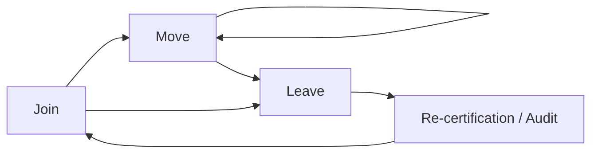

# Identity Lifecycle and Provisioning

## Feynman Explanation

Every digital identity in a company goes through the same three life events: **join** (new hire, contractor, service account created), **move** (changes role, department, location — the account changes too), and **leave** (termination, contract end, service retired — the account must be disabled and removed). The single most expensive IAM failure in 2024 was *forgetting step three*. The discipline of doing all three — on time, with audit evidence, across every system — is what separates a real Identity Governance & Administration (IGA) program from a directory full of orphaned accounts waiting to be sold on a criminal forum.

## Technical Details

### 1. The Join-Move-Leave Model (the canonical lifecycle)



| Phase | HR Trigger | IT Action | Audit Evidence |
|---|---|---|---|
| **Join** | Offer accepted / contract signed | Identity proofing → account create → role assignment → MFA enrollment → asset issuance | Provisioning ticket, role-catalog entry, attestation |
| **Move** | Title / department / location change | Re-evaluate role, remove obsolete roles, add new roles, update attributes | Workflow ID, role diff, manager attestation |
| **Leave** | Termination / resignation / contract end | Disable → revoke sessions → archive mailbox → retain or delete per policy | Deprovisioning ticket, timestamp, dual control |
| **Re-certify** | Quarterly / annual | Manager attests that subordinates' access is still correct | Attestation record, exceptions list |

### 2. The Provisioning Pattern (request → approval → fulfillment → audit)

```
Requester (manager)            Approver(s)              Provisioning system          Target system(s)
       │                              │                          │                            │
       │──── 1. Request role X ───────▶│                          │                            │
       │                              │── 2. Policy + SoD check ──▶│                            │
       │                              │── 3. Approve / reject ────▶│                            │
       │                              │                          │── 4. Create account / assign role
       │                              │                          │── 5. Push to AD / SaaS via SCIM ─▶
       │                              │                          │── 6. Send credentials / MFA enroll │
       │                              │                          │◀─ 7. Confirmation ──────────────│
       │◀──── 8. Notify + evidence ───│◀─────────────────────────│                            │
```

Key controls:

- **Least-privilege default** — assign the smallest role that satisfies the request; never copy a peer.
- **Segregation of Duties (SoD)** — block if the new role combined with existing roles violates an SoD rule.
- **Maker / Checker** — the person requesting ≠ the person approving.
- **Time-bound assignment** — every privilege has an expiry; JIT re-approval at expiry.

### 3. Joiner — Day-Zero Controls

| Control | Why it matters | Exam hook |
|---|---|---|
| **Identity proofing** (IAL1/2/3 per NIST 800-63A) | Establishes the real-world identity | "Self-asserted" = low assurance; in-person or remote-with-credential = high |
| **Unique identifier (UPN, sAMAccountName, email)** | No shared accounts | "Use firstname.lastname" but check collisions |
| **Baseline role** | The smallest role the job needs | "Marketing-Associate" not "Marketing-All" |
| **MFA enrollment** | Strong authentication from day 1 | Recovery flow tested before day 1 |
| **Documented acceptable-use acknowledgment** | Legal evidence of informed consent | "I have read the security policy" |
| **Service-account identity** | Machine identities are first-class | Owner + rotation schedule + secret in vault |

#### Identity proofing tiers (NIST 800-63A)

| IAL | Identity evidence | Verification |
|---|---|---|
| **IAL1** | Self-asserted | None — attribute is unverified |
| **IAL2** | One piece of evidence (passport, driver's licence) | Remote or in-person |
| **IAL3** | Two pieces of strong evidence | In-person or remote with cryptographic proofing |

### 4. Mover — the Privilege-Creep Killer

A user accumulates roles over time; left unchecked, a 5-year employee has the union of everything they ever needed. This is **privilege creep** and is the second-most-expensive IAM failure mode.

Controls:

- **Role diff** on move — show manager the *added* and *removed* entitlements, get explicit acknowledgement.
- **Time-bound role assignments** — every role has an expiry, default 90 days, auto-removes unless re-approved.
- **Reconcile** role catalogue annually — remove unused roles.
- **SoD re-check on every assignment** — the new combined set must not violate any SoD.

### 5. Leaver — the Most-Attacked Window

A terminated employee whose account is still active is the textbook insider threat. The SANS / Verizon DBIR consistently find that **30-50% of breaches involve dormant or deprovisioned accounts** (e.g., 2024 Snowflake customer breach pattern).

#### Deprovisioning SLA (industry baseline)

| System tier | Time-to-disable | Time-to-delete |
|---|---|---|
| Tier 1 — Customer-facing, internet-exposed (VPN, IdP, SaaS) | **< 15 minutes** | 30-90 days (archive) |
| Tier 2 — Internal business apps (email, file shares, ERP) | **< 4 hours** | 30-90 days |
| Tier 3 — Sensitive regulated (financial, health, payment) | **< 1 hour** | per regulation (e.g., 6 yrs SOX) |
| Service / machine accounts | Disable at contract end | Vault rotation + revocation |

#### Why "disable" ≠ "delete"

- **Disable** — account cannot authenticate, but is preserved for audit / evidence / rehire. Reversible.
- **Delete** — irreversible, data and audit history may be lost. Required for GDPR "right to erasure" *only* after regulatory retention is satisfied.

> **Exam hook:** Termination workflow order: (1) revoke sessions, (2) disable, (3) archive, (4) delete. (1) and (2) must happen *before* the leaver is informed, in high-risk terminations.

### 6. Service and Machine Identities (the 10x problem)

A modern enterprise has **10-50x more machine identities than human ones** (microservices, API keys, cloud service principals, CI runners, RPA bots). The lifecycle for them is the same — create, rotate, retire — but the discipline is usually weaker.

| Identity type | Provisioning | Rotation | Retirement |
|---|---|---|---|
| Service account (AD `svc-*`) | IGA workflow + owner | 90 days, vaulted secret | Owner decommission |
| Cloud service principal | IaC (Terraform) | IAM Access Analyzer + 90-day key rotation | Destroy at workload decommission |
| API key | Vault dynamic secret | 24 h or 1-time use | Immediate on suspicion |
| OAuth client credential | Vault + expiring | 30-90 days | Revoke at app end-of-life |
| TLS server cert | ACME / internal CA | 90 days (Let's Encrypt) or 1 year | Auto-replace; private key destruction |
| SSH user key | SSH CA or short-lived cert (SSO) | 1-24 h | Auto-expiry (no static keys) |

### 7. SCIM — System for Cross-domain Identity Management (RFC 7644)

**Purpose:** A standard REST + JSON protocol to push user and group lifecycle events from the source-of-truth (IdP / HR) to target SaaS apps.

| Verb | SCIM mapping | Example |
|---|---|---|
| Create user | `POST /Users` | New hire → Okta → Slack, GitHub, Salesforce |
| Read user | `GET /Users/{id}` | App pulls profile on login |
| Update user | `PATCH /Users/{id}` (RFC 7644 §3.5.2) with JSON Patch | Move: department = "Finance" |
| Disable user | `PATCH {active: false}` or `DELETE /Users/{id}` | Termination |
| Group membership | `PATCH /Groups/{id}` `members` | Add to "Eng-All" |

#### SCIM 2.0 schema (RFC 7643)

```json
{
  "schemas": ["urn:ietf:params:scim:schemas:core:2.0:User"],
  "userName": "alice@example.com",
  "name": { "givenName": "Alice", "familyName": "Smith" },
  "emails": [{ "value": "alice@example.com", "primary": true }],
  "active": true,
  "title": "Senior Engineer",
  "addresses": [{ "country": "DE" }]
}
```

#### Why SCIM matters

- **Single source of truth** — the IdP / HR system of record owns the lifecycle.
- **Real-time** — termination in HR = disable in every SaaS within seconds.
- **Audit trail** — every SCIM event is logged at both ends.

### 8. JIT — Just-in-Time Access (the privileged pattern)

**Pattern:** No standing privilege. To get elevated rights, the user requests → an approval workflow → a short-lived ticket / role is issued → the ticket expires automatically.

| Form | Mechanism | TTL |
|---|---|---|
| Cloud (AWS, Azure, GCP) | IAM role assumption via SAML / Web SSO; no static keys | 1 hour |
| Linux sudo | `sudo` with ticket + MFA | 15 min - 8 h |
| AD privileged groups | Temporary group membership via PAM tool | 1-4 h |
| Database elevated session | `SET ROLE` to a higher-privilege role | 1 h |
| Kubernetes | Impersonation bound to a short-lived token | 15-60 min |

> See L3 [[privileged-access-management-pam]] for the full pattern.

### 9. IGA — Identity Governance & Administration (the product category)

A modern IGA platform owns:

| Capability | Tools / Vendors |
|---|---|
| Identity repository (authoritative source) | HR (Workday, SAP), IdP (Okta, Entra ID, Ping) |
| Provisioning connectors | SCIM, LDAP, custom agents |
| Workflow / approval engine | Built-in (SailPoint, Saviynt) or external (ServiceNow) |
| Role mining & modelling | Role analytics dashboards |
| Access certification campaigns | Quarterly attestations |
| SoD ruleset | Pre-built (SAP GRC) or custom |
| Audit / evidence | Immutable logs, dashboards |
| Reporting | Compliance reports (SOX, HIPAA) |

### 10. Account Reconciliation and Orphan Hunting

| Control | Frequency | Tool |
|---|---|---|
| Compare HR roster to active accounts | Daily | IdP / IGA reconciliation job |
| Disable accounts inactive > 30 days | Daily | IGA / IAM policy |
| Remove accounts disabled > 90 days | Weekly | IGA / cleanup job |
| Service-account ownership attestation | Annually | IGA campaign |
| "Last login" review | Quarterly | SIEM / IdP report |
| Disable dormant OAuth grants | Daily | Cloud Access Security Broker (CASB) |

### 11. Off-boarding Checklist (the executive view)

A terminated user is a **time-bomb** until the workflow closes. The non-negotiable steps:

1. **Revoke all active sessions** (IdP, VPN, SaaS) — *before* the conversation, for involuntary terminations.
2. **Disable** the primary account; reset / rotate any shared passwords they knew.
3. **Disable** all federated accounts and OAuth grants.
4. **Reset** API keys and service-account secrets they could have seen.
5. **Recover** assets (laptop, phone, token, smart card, FIDO2 key).
6. **Archive** mailbox; legal hold if litigation.
7. **Re-attest** any open role memberships across the org.
8. **Reissue** any team-shared credentials (Wi-Fi PSK, break-glass).
9. **Log** every step with timestamp and operator.

### 12. Exam Pattern Recap

- **Join = create** with proofing + baseline role + MFA
- **Move = re-provision** with role diff + SoD check
- **Leave = disable + revoke sessions + archive + (later) delete**
- **SCIM = provisioning protocol**, OAuth = authz, SAML/OIDC = authn
- **JIT = no standing privilege**, time-bound, approval-gated
- **Re-certification = periodic attestation** by manager
- **SoD = no single person can complete + approve a sensitive task**

## CISO / Risk Manager View

Lifecycle is the part of IAM the board **rarely** asks about — and the part that causes the **biggest** breach headlines. The CISO playbook is to make lifecycle measurable, automatic, and auditable.

| Metric | What it tells you | Target |
|---|---|---|
| **Time-to-disable on termination** | How fast we close the most dangerous door | < 15 min Tier 1, < 4 h Tier 2 |
| **% of orphan accounts** | How clean the directory is | < 1 % of total |
| **% of standing privileged accounts** | Concentration of standing admin risk | < 5 % of admin accounts |
| **Re-certification coverage** | How often access is attested | 100 % of high-risk systems quarterly |
| **Service-account owner attestation** | Machine-identity hygiene | 100 % annually |
| **Average roles per user** | Privilege-creep signal | < 8 in stable orgs |
| **JIT adoption %** | Move from standing to ephemeral | > 80 % of privileged in 2 years |
| **% of accounts with no login > 90 days** | Dormant-account risk | < 2 % |

**Maturity ladder (lifecycle-specific):**

| Level | Name | Defining characteristic |
|---|---|---|
| 1 | Ad hoc | Manual tickets, 7-day disable SLA, orphan accumulation |
| 2 | Defined | SCIM from HR, 24-h disable, basic attestation |
| 3 | Managed | Full IGA, JIT for privileged, SoD enforcement, quarterly cert |
| 4 | Measured | Risk-scored certification, automated orphan hunt, ML-based anomaly review |
| 5 | Adaptive | Continuous attestation, automatic role-mining, least-privilege by default, no standing admin |

**The "M&A Day-One" question:** when you acquire a company, on day one you must disable all accounts that should not migrate, rotate all shared secrets, and re-provision all surviving employees. The IGA stack is what makes that possible. If you cannot do it in 48 hours, your IAM is a liability.

**Privileged concentration:** even after PAM, the **non-privileged** identity fleet is still the largest attack surface. Lifecycle discipline on the *long tail* (every employee, every contractor, every service account) is what reduces the chance of the next "dormant OAuth grant" or "rehired-but-not-revoked" headline.

**Compliance hooks:** SOX (financial systems access), PCI-DSS 7, 8 (least privilege + unique IDs), HIPAA 164.308(a)(3) (workforce security), GDPR Art. 5 + 32 (data minimization + security of processing), ISO 27001 A.5.16 (identity management), A.5.18 (access rights), A.5.19 (supplier relationships). IGA is the *evidence* engine for all of them.

## Related Connections

### Sibling L2
- [[authentication-factors-and-mechanisms]] - Strong auth is required at day 1 (Join)
- [[authorization-models]] - Role catalogue + SoD rules are the input to provisioning
- [[federation-sso-and-saml-oidc]] - Federation lets provisioning span orgs
- [[access-control-attacks-and-mitigations]] - Stale / orphaned accounts are the attack target

### L3
- [[privileged-access-management-pam]] - JIT is the privileged-slice of lifecycle
- [[kerberos-protocol-deep-dive]] - Service-account SPNs and Kerberoasting target the lifecycle gap
- [[multi-factor-authentication-mfa]] - Enrollment is part of the Join flow
- [[zero-trust-architecture-nist-800-207]] - Continuous re-authorization is "lifecycle per request"

### Cross-Domain
- [[domain-01-security-and-risk-management]] - Join/Move/Leave is a risk-treatment decision
- [[domain-07-security-operations]] - Lifecycle events feed the SIEM; orphan hunt is an ops control
- [[domain-08-software-development-security]] - Service identities in code; secrets in repos

## Sources / References

- NIST SP 800-63A - Digital Identity Guidelines: Identity Proofing and Enrollment
- NIST SP 800-63B - Digital Identity Guidelines: Authentication and Lifecycle Management
- IETF RFC 7642 - SCIM: Definitions, Overview, Concepts, and Requirements
- IETF RFC 7643 - SCIM: Core Schema
- IETF RFC 7644 - SCIM: Protocol
- ISO/IEC 24760-1:2019 - Identity management framework
- ISO/IEC 29146:2016 - A framework for access management
- ISO/IEC 27001:2022 - Annex A.5.16 Identity management, A.5.18 Access rights
- (ISC)² CISSP CBK 2024 - Domain 5.3 / 5.7
- OWASP Identity Provisioning Cheat Sheet
- SANS Institute - "Identity and Access Management: Lifecycle Best Practices"
- Verizon 2024 DBIR - Credential and identity-related patterns
