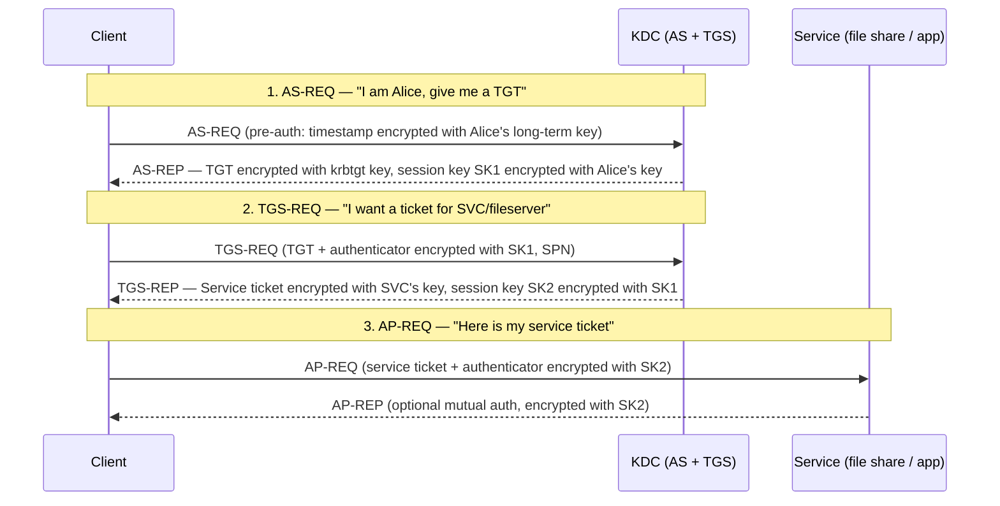

# Kerberos Protocol Deep Dive

## Feynman Explanation

Kerberos is the ticket system that Active Directory uses so you only type your password once in the morning and then every internal app just waves you through. The three actors are **you** (the client), the **Key Distribution Center** (the trusted ticket-issuer, AD's authentication service), and the **service** (the file share, mail server, app). You prove your identity once to the KDC, get a "granting ticket," exchange it for a "service ticket" at the file share, and the file share trusts the KDC so it lets you in. The whole thing is built on symmetric cryptography and tickets that expire — and that ticket model is what makes both the speed and most of the famous AD attacks (Pass-the-Hash, Kerberoasting, Golden Ticket).

## Technical Details

### 1. The Three Actors and the Four Messages (the spine)



| Acronym | Full name | Role |
|---|---|---|
| **KDC** | Key Distribution Center | The trusted ticket issuer. In AD: a Domain Controller. |
| **AS** | Authentication Service | The KDC's TGT-issuing half (KRB_AS_REQ / KRB_AS_REP) |
| **TGS** | Ticket Granting Service | The KDC's service-ticket half (KRB_TGS_REQ / KRB_TGS_REP) |
| **TGT** | Ticket Granting Ticket | Long-lived ticket (default 10 h) used to ask for service tickets |
| **Service ticket** | (a.k.a. ST, TGS ticket) | Per-service ticket (default 1 h) granting access to one SPN |
| **SPN** | Service Principal Name | The name of a service instance: `service/host:port` or `HTTP/host` |
| **PAC** | Privilege Attribute Certificate | The user's authorization data (SIDs, group memberships) inside the TGT / service ticket |
| **Pre-auth** | Pre-authentication | The encrypted-timestamp step in AS-REQ that defeats offline password guessing |

### 2. Cryptographic Primitives

Kerberos v5 (RFC 4120) supports a defined set of encryption types ("enctypes"):

| Enctype | Algorithm | Status (2024) |
|---|---|---|
| `0` | `none` | Forbidden (replay; security hole) |
| `1` | DES-CBC-CRC | Broken; disable |
| `3` | DES-CBC-MD5 | Broken; disable |
| `17` / `0x11` | RC4-HMAC | Legacy (used for NTLM interop); vulnerable to Pass-the-Hash / Kerberoasting. Disable if possible. |
| `18` / `0x12` | AES128-CTS-HMAC-SHA1-96 | Current acceptable |
| `20` / `0x14` (`AES256`) | AES256-CTS-HMAC-SHA1-96 | Current best |
| `26` (`CAMELLIA128`) | Camellia128-CTS | Acceptable |
| `27` (`CAMELLIA256`) | Camellia256-CTS | Acceptable |

> **Exam hook:** "Disable RC4 in Kerberos" is the modern AD hardening default.

### 3. The Four Messages in Detail

#### 3.1 KRB_AS_REQ (Authentication Service Request)

```
AS-REQ {
    pvno: 5
    msg-type: 10 (AS-REQ)
    padata: [PA-ENC-TIMESTAMP] {
                    patype: 2 (PA-ENC-TIMESTAMP)
                    value: enc{current_time, microseconds, krbtgt/REALM@REALM}client_long_term_key
                }
    req-body: {
        kdc-options: forwardable, renewable, proxiable, etc.
        cname: alice@REALM
        realm: REALM
        sname: krbtgt/REALM@REALM    (always the TGS service for AS-REQ)
        from: 2026-07-08T10:00:00Z   (requested start time)
        till: 2026-07-08T20:00:00Z   (requested end time)
        rtime: 2026-07-15T20:00:00Z  (renewal time)
        nonce: 1234567890
        etype: [18, 17, 23, -128]    (AES256, RC4, AES128, FAST)
    }
}
```

The **pre-authentication** is the critical security control: the client encrypts a current timestamp with its long-term key (derived from password). The KDC decrypts it; if it works, the client knows the password; if it doesn't, the KDC rejects. **This is what defeats offline AS-REP roasting** — accounts with "Do not require Kerberos preauthentication" are exposed.

#### 3.2 KRB_AS_REP (Authentication Service Reply)

```
AS-REP {
    pvno: 5
    msg-type: 11 (AS-REP)
    padata: [PA-ETYPE-INFO2, ...]
    crealm: REALM
    cname: alice@REALM
    ticket: {                       (this is the TGT, encrypted with krbtgt key)
        tkt-vno: 5
        realm: REALM
        sname: krbtgt/REALM@REALM
        flags: initial, pre-auth, renewable, forwardable
        key: { keytype: AES256, keyvalue: SK1 }
        crealm: REALM
        cname: alice@REALM
        transited: { ... }
        authtime: 2026-07-08T10:00:00Z
        starttime: 2026-07-08T10:00:00Z
        endtime: 2026-07-08T20:00:00Z
        renew-till: 2026-07-15T20:00:00Z
        caddr: 10.0.0.0/24           (client addresses)
        authorization-data: PAC {   (in MIT krbtgt/REALM, in AD: in both ticket and AS-REP)
            PAC_TYPE_LOGON_INFO: {
                user_rid, group_rids, group_memberships, logon_domain, user_flags
            }
        }
    }
    enc-part: {                     (encrypted with Alice's long-term key)
        key: { keytype: AES256, keyvalue: SK1 }
        msg-type: 11
        nonce: 1234567890
        key-expiration: 2026-07-08T20:00:00Z
        flags: ...
        authtime, starttime, endtime, renew-till, sname, srealm
    }
}
```

The client now has:

- **TGT** (encrypted with `krbtgt` key — only the KDC can read it)
- **SK1** (session key, encrypted with the user's long-term key — only the user can read it)

#### 3.3 KRB_TGS_REQ (Ticket Granting Service Request)

```
TGS-REQ {
    pvno: 5
    msg-type: 12 (TGS-REQ)
    padata: [PA-TGS-REQ] {                    (the TGT, with an AP-REQ inside)
        ap-req: {
            pvno, msg-type: 14,
            ap-options: mutual-auth?,
            ticket: TGT (encrypted with krbtgt key — passed through unchanged)
            authenticator: enc{SK1}{client_id, client_addr, current_time, subkey?}  (encrypted with SK1)
        }
    }
    req-body: {
        kdc-options, realm,
        sname: SVC/fileserver.example.com@REALM  (the target service)
        from, till, rtime,
        nonce: 0987654321,
        etype: [18, 17, 23, -128]
    }
}
```

The KDC decrypts the TGT with its `krbtgt` key, decrypts the authenticator with SK1 (proves the user has the session key), and validates the PAC (authorization data).

#### 3.4 KRB_TGS_REP (Ticket Granting Service Reply)

```
TGS-REP {
    pvno: 5
    msg-type: 13 (TGS-REP)
    ticket: {                          (service ticket, encrypted with SVC's long-term key)
        tkt-vno: 5
        realm: REALM
        sname: SVC/fileserver.example.com@REALM
        flags: forwardable, renewable, initial
        key: { keytype: AES256, keyvalue: SK2 }
        crealm: REALM
        cname: alice@REALM
        transited: { ... }
        authtime: 2026-07-08T10:00:00Z
        starttime, endtime (1 h default),
        caddr,
        authorization-data: PAC { ... }  (copied from TGT — service trusts the KDC's PAC)
    }
    enc-part: {                        (encrypted with SK1 — only the user can decrypt)
        key: { keytype: AES256, keyvalue: SK2 }
        msg-type: 13
        nonce: 0987654321
        sname, srealm, flags, authtime, starttime, endtime
    }
}
```

The client now has:

- **Service ticket** (encrypted with the SVC's key — only the SVC can read it)
- **SK2** (session key, encrypted with SK1 — only the client can read it)

#### 3.5 KRB_AP_REQ / KRB_AP_REP (Application Request)

```
AP-REQ {
    pvno: 5
    msg-type: 14
    ap-options: mutual-auth? (true if mutual auth required)
    ticket: service ticket (passed through)
    authenticator: enc{SK2}{user_id, client_addr, current_time, subkey?}
}
```

The SVC decrypts the service ticket with its long-term key, gets SK2, decrypts the authenticator with SK2, validates the timestamp, and trusts the PAC for authorization. If `mutual-auth` was set, the SVC sends back an AP-REP:

```
AP-REP {
    pvno: 5
    msg-type: 15
    enc-part: enc{SK2}{subkey?, seq-number}
}
```

### 4. The PAC — Privilege Attribute Certificate

The PAC is the AD-specific authorization blob in the ticket. It contains:

- **User RID** and **primary group RID**
- **Group memberships** (SIDs and RIDs)
- **User Account Control** flags (e.g., `UF_DONT_REQUIRE_PREAUTH`, `UF_TRUSTED_FOR_DELEGATION`)
- **Logon domain**
- **Logon server**
- **User flags** (e.g., `LOGON_RESOURCE_GROUPS`)
- **Extra SIDs** (SID history, resource group SIDs)
- **Client claims** (claims-based auth)
- **Device info** (for conditional access)
- **User signature** and **service signature** (HMACs to prevent PAC tampering by the KDC)

**Why it matters:** the PAC is the **authorization** half of Kerberos. The service trusts the KDC's PAC for "what can this user do." If the PAC is forged, the attacker can elevate. This is the basis of **Golden Ticket** (forge PAC in a TGT) and **Silver Ticket** (forge PAC in a service ticket) attacks.

### 5. The `krbtgt` Account — the Crown Jewel

- Every KDC has a `krbtgt` account; its long-term key encrypts the TGT.
- **Compromise of `krbtgt` = forge any TGT = "Golden Ticket" — total domain compromise.**
- **Compromise of an SPN's long-term key = forge service tickets for that service — "Silver Ticket."**
- **Best practice:** `krbtgt` rotation twice (with delay) after any DC compromise. Windows now does automatic `krbtgt` rotation.

### 6. Pre-Authentication and AS-REP Roasting

| Setting | Behavior | Risk |
|---|---|---|
| "Do not require Kerberos preauthentication" | AS-REQ does **not** require the encrypted timestamp; anyone can request an AS-REP and **crack the user's password offline** | AS-REP Roasting — equivalent to cracking a stolen hash |
| Default (preauth required) | KDC rejects AS-REQ without the encrypted timestamp; attacker must complete preauth to know if a user is valid | Standard |

**Defense:** ensure "Do not require Kerberos preauthentication" is **unset** on every account. Use a script / GPO audit to find any user with this flag.

### 7. FAST (Flexible Authentication Secure Tunneling) and PKINIT

| Mechanism | Purpose |
|---|---|
| **PKINIT** (RFC 4556) | Use a certificate (smart card) instead of password preauth |
| **FAST** (RFC 6113) | Wrap AS-REQ / TGS-REQ in a "armor" ticket (TGT) so the inner exchange is hidden from a passive attacker |
| **Kerberos armoring** | Same idea, used to protect preauth from offline attacks |

PKINIT is the basis of **smart-card logon to AD** — what you get with a CAC / PIV card.

### 8. Cross-Realm Trust and Referrals

- A `krbtgt/REALM_A@REALM_A` is valid only in its own realm.
- For cross-realm, a **transit** path is built: `krbtgt/REALM_B@REALM_A` is a referral ticket. The client uses this to authenticate to a KDC in REALM_B, which issues the final service ticket.
- **Transitive trust** in AD: `A` trusts `B`, `B` trusts `C` → `A` transitively trusts `C` (with caveats). This is the "forest trust" mechanism.

### 9. Delegation — the most-abused feature

| Mode | Mechanism | Risk |
|---|---|---|
| **Unconstrained delegation** | SVC receives a TGT from the client; can use it to authenticate to **any** other service on the user's behalf | Total compromise if SVC is compromised — PrinterBug, Coercer → DC compromise |
| **Constrained delegation** (S4U2Self / S4U2Proxy) | SVC can act on behalf of a user to **specified** services only | Less risky; still abusable if misconfigured |
| **Resource-based constrained delegation (RBCD)** | The resource SVC specifies who can delegate to it | Common misconfiguration: attacker writes RBCD to a service and impersonates users to it |
| **Protocol transition** (S4U2Self) | Service can obtain a service ticket for a user who **did not** authenticate via Kerberos (e.g., HTTP basic) | Often paired with constrained delegation; abused in print spooler / AD CS / web attacks |

> **Exam hook:** Unconstrained delegation is the dangerous default of the 2000s; modern AD turns it off except on legacy hosts.

### 10. Service Account Hardening

| Control | Why |
|---|---|
| **gMSA** (Group Managed Service Account) | Auto-rotated 30-day password; managed by AD; ≥ 256-bit secret; eliminates Kerberoasting |
| **≥ 25-character random password** | Defeats offline Kerberoasting |
| **AES-only enctype** | RC4 service tickets can be cracked offline |
| **Disable "Do not require preauth"** | Prevents AS-REP roasting |
| **Restrict to specific hosts** | SPN scoping |
| **Don't make it Domain Admin** | Privilege concentration |

### 11. Kerberos in the Wild — Protocol Cheat Sheet

| Step | Message | Encrypted with | Sent in the clear? |
|---|---|---|---|
| AS-REQ | Preauth blob | Client's long-term key | yes (the KDC must read the preauth) |
| AS-REP | TGT | krbtgt key | yes (only the KDC can read the TGT) |
| AS-REP | Session key SK1 | Client's long-term key | yes (only the client can read SK1) |
| TGS-REQ | Authenticator | SK1 | yes (only the KDC can read it) |
| TGS-REP | Service ticket | SVC's long-term key | yes (only the SVC can read it) |
| TGS-REP | Session key SK2 | SK1 | yes (only the client can read it) |
| AP-REQ | Authenticator | SK2 | yes (only the SVC can read it) |
| AP-REP | (mutual auth) | SK2 | yes (only the client can read it) |

> **Exam hook:** "Kerberos encrypts each *session* key only with the *previous* session key. A passive attacker on the wire cannot read the ticket or the session keys — that's the *confidentiality* of Kerberos."

### 12. Kerberos Attacks — the Modern Catalogue

| Attack | What it does | Defense |
|---|---|---|
| **Pass-the-Hash (PtH)** | Use captured NT hash to get a TGT via RC4 preauth | Disable RC4; require AES; smart card / PKINIT; LSA Protection |
| **Pass-the-Ticket (PtT)** | Replay a captured TGT or service ticket | TGT TTL; restrict ticket caching; LSA Protection |
| **Kerberoasting** | Request service ticket for an SPN with a known username, crack offline | gMSA, ≥ 25 char passwords, AES only |
| **AS-REP Roasting** | Request AS-REP for a user with preauth disabled | Disable "Do not require preauth" |
| **Golden Ticket** | Forge TGT with the `krbtgt` hash | Monitor PAC anomalies; rotate `krbtgt`; alert on impossible TGTs |
| **Silver Ticket** | Forge service ticket with the SVC's hash | Same; restrict service account logon |
| **DCShadow** | Register a rogue DC; push changes | Audit DC promotion events |
| **DCSync** | Replicate directory data with `Replicating Directory Changes` rights | Restrict that right to actual DCs only |
| **Unconstrained delegation abuse** | Compromise host with unconstrained delegation; capture TGTs of anyone who authenticates to it | Disable unconstrained delegation; Protected Users group |
| **RBCD abuse** | Write RBCD on a service; impersonate users to it | Audit `msDS-AllowedToActOnBehalfOfOtherIdentity` writes |
| **NTLM relay** | Downgrade Kerberos to NTLM and relay to another service | Enforce Kerberos; EPA (LDAP signing, SMB signing); disable NTLM |
| **Bronze bit** (CVE-2020-17049) | Downgrade Kerberos delegation by flipping a bit | Patch |

### 13. Hardening Checklist (exam + practical)

| Setting | Recommended |
|---|---|
| `krbtgt` rotation | Automatic in modern AD; twice after any compromise |
| RC4 in Kerberos | Disabled (`Network security: Configure encryption types allowed for Kerberos: AES only`) |
| NTLM | Disabled (`Network security: Restrict NTLM`) |
| Unconstrained delegation | Off; PAW for admins |
| Service account passwords | gMSA, ≥ 25 chars random, AES only |
| "Do not require preauth" | Unset everywhere |
| Protected Users group | Add all privileged accounts |
| LSA Protection (RunAsPPL) | Enabled on all hosts |
| Credential Guard | Enabled on Windows 10+ for admins |
| LDAP signing / channel binding | Required |
| SMB signing | Required |
| EPA (Extended Protection for Authentication) | Enabled on web apps that accept NTLM / Kerberos |
| Tiered admin model | T0 (DC), T1 (servers), T2 (workstation); PAW for T0/T1 |
| Detection | Honey creds / honey SPNs; alert on RC4 ticket requests; alert on TGTs older than 10 h |

### 14. MIT Kerberos vs Microsoft AD Kerberos

| Property | MIT | MS AD |
|---|---|---|
| PAC | Optional, used for integration with AD | Required |
| Cross-realm | Configurable transitive | Forest trust, automatic transitive within forest |
| Preauth | Required by default (since 1.6) | Required by default |
| PKINIT | Yes | Yes (smart card) |
| Service account management | `kadmin`, keytabs | AD UC + gMSA |
| Enctypes | Pluggable | AES / RC4 (RC4 = legacy) |

## CISO / Risk Manager View

Kerberos is the **invisible backbone** of most enterprise authentication. If it is broken, the entire AD estate is broken — and AD is, for most enterprises, 70-90% of identity. The CISO playbook:

| Investment | What it buys | Time to deploy |
|---|---|---|
| **Disable RC4 in Kerberos** | Closes Kerberoasting on RC4-only SPNs | 1 quarter |
| **gMSA for all service accounts** | Eliminates the Kerberoasting and PtH target | 1-2 quarters |
| **Protected Users group for all admins** | No Kerberos delegation, no NTLM, no DES, no RC4 for admins | 1 quarter |
| **LSA Protection (RunAsPPL) on every host** | Stops Mimikatz-style LSASS dumping | 1 quarter (GPO) |
| **Credential Guard on Windows 10+** | Isolates LSA secrets in a VTL | As endpoints refresh |
| **Tiered admin model + PAW** | Limits the blast radius of any admin compromise | 2-3 quarters |
| **Disable unconstrained delegation everywhere** | Removes the easiest path to DC compromise | 1-2 quarters |
| **NTLM disabled** | Removes the relay-and-downgrade attack surface | 1-2 years (legacy apps) |
| **Honey SPNs + honey creds** | Detection of Kerberoasting and PtH | 1 quarter |
| **Continuous `krbtgt` rotation** | Stale `krbtgt` cannot be reused | Now (built-in) |

**Risk concentration:** the **Domain Controller** (the KDC) is the single most privileged asset in the enterprise. A DC compromise is total AD compromise. Tier-0 must be physically and logically separated (PAW, dedicated VLANs, no internet egress, no email, no admin from user accounts).

**Maturity ladder (Kerberos-specific):**

| Level | Name | Defining characteristic |
|---|---|---|
| 1 | Default | RC4 allowed, NTLM allowed, unconstrained delegation in places |
| 2 | Hardened | RC4 disabled, NTLM restricted, LSA Protection on critical hosts |
| 3 | Modern | gMSA everywhere, AES-only, unconstrained delegation removed, Protected Users |
| 4 | Tiered | PAW + tier model; Tier-0 isolated; honey creds |
| 5 | Continuous | NTLM disabled; PKINIT / smart card for admin; continuous `krbtgt` rotation; near-real-time PAC anomaly detection |

**Compliance hooks:** PCI-DSS 8.3 (strong auth), DISA STIG for Windows / AD, NIST 800-53 AC-2, IA-2, IA-5, SC-8 (Kerberos keys counted as cryptographic protection).

## Related Connections

### Parent L2
- [[authentication-factors-and-mechanisms]] - Kerberos is the inside-the-firewall factor model for AD

### Sibling L3 (this domain)
- [[multi-factor-authentication-mfa]] - MFA via smart card maps to PKINIT
- [[privileged-access-management-pam]] - The `krbtgt` account is the most privileged in the enterprise
- [[zero-trust-architecture-nist-800-207]] - Zero Trust assumes the DC is compromised; reduce blast radius

### Cross-Domain
- [[domain-04-communication-and-network-security]] - Kerberos over UDP/88 and TCP/88; LDAP (389/636); SMB (445); DNS SVR records
- [[domain-07-security-operations]] - AD is critical infrastructure for the SOC

## Sources / References

- IETF RFC 4120 - The Kerberos Network Authentication Service (V5)
- IETF RFC 4556 - Public Key Cryptography for Initial Authentication in Kerberos (PKINIT)
- IETF RFC 4757 - The RC4-HMAC Kerberos Encryption Type
- IETF RFC 6113 - A Generalized Framework for Kerberos Pre-Authentication (FAST)
- IETF RFC 6806 - Kerberos Principal Name Canonicalization and Cross-Realm Referrals
- Microsoft - "[MS-KILE] Kerberos Protocol Extensions"
- Microsoft - "[MS-PAC] Privilege Attribute Certificate Data Structure"
- Microsoft - "Kerberos Authentication Technical Reference"
- Microsoft - "Protected Users Security Group"
- Microsoft - "Unconstrained Delegation Risks"
- Sean Metcalf (ADSecurity) - "Kerberoasting", "Golden Ticket", "Silver Ticket" catalogues
- Orange Cyberdefense "The Hacker Recipes" - Active Directory
- Will Schroeder (Harmj0y) - "Roasting AS-REP", "S4U2Pwnage"
- Benjamin Delpy (GentilKiwi) - Mimikatz documentation
- ANSSI (France) - "Kerberos - État de l'art" (2023)
- (ISC)² CISSP CBK 2024 - Domain 5.4 / 5.5
