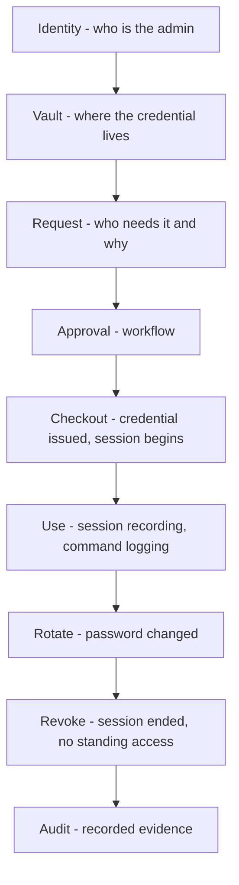

# Privileged Access Management (PAM)

## Feynman Explanation

Privileged accounts — Domain Admins, root, `sudo`, cloud-`Owner`, database `sysadmin` — own the keys to the kingdom. PAM is the discipline of *removing* those standing keys from humans and putting them in a vault that hands them out for one specific job, for a specific time, while recording everything that happens. A good PAM program means no human knows the root password to a server; they check it out, use it, and the password is rotated the moment they finish. The result is that an attacker who compromises an admin laptop cannot also compromise every server — and every privileged action is on a recording the auditor can replay.

## Technical Details

### 1. The PAM Problem — Why It Matters

| Concentration metric | Typical value in a mature enterprise |
|---|---|
| % of accounts that are privileged | < 2 % of human accounts; > 50 % of *machine* identities in a cloud-first shop |
| % of entitlements owned by privileged accounts | 70-90 % |
| % of breaches involving privileged credentials | 70-80 % (Verizon DBIR 2024) |
| Time-to-detect privileged misuse | Days to months in the absence of session recording |
| % of standing privileged accounts that should be JIT | Target: < 5 % of total |

**Why admins are the prime target:** one compromised admin = entire domain / cloud tenant / production database. The "blast radius per dollar of attack effort" is highest on privileged accounts.

### 2. The PAM Lifecycle



### 3. Credential Vaulting (the foundation)

The vault is the **single source of truth** for all privileged credentials. Humans do not know the password; the vault knows it, and the vault hands it out (or mediates the connection).

| Capability | Mechanism |
|---|---|
| **Storage** | AES-256 at rest, HSM-backed master key |
| **Discovery** | Scan the network for accounts, services, SSH keys, database creds |
| **Onboarding** | Bring a credential into the vault; rotate it; inject the new one into the target system |
| **Access** | Vault-authenticated user checks out a credential for a session |
| **Rotation** | The vault rotates the password / key after every checkout, on a schedule, or both |
| **Broker** | The vault acts as a proxy — user connects *to the vault*, vault opens session *to the target*; user never sees the credential |
| **API** | Programmatic checkout for automation (e.g., CI runners) |
| **Master key** | Stored in HSM; quorum-based access (M-of-N custodians) |

#### Vault pattern (broker-mediated)

```
Admin (browser / RDP / SSH client)
        │            ↑
        ▼            │
   PAM Vault (PSM)  ── audit, recording, policy enforcement
        │
        ▼
   Target system (server, DB, network device)
```

#### Vault pattern (credential injection)

```
CI/CD pipeline
        │  call vault API: checkout cred
        ▼
   PAM Vault
        │
        ▼
   Inject credential into target API / DB at run time
   (never appears in logs, env vars, code)
```

### 4. Just-in-Time (JIT) Privilege (the modern best practice)

**Pattern:** No standing privilege. To perform a privileged action, the user requests → workflow approves → short-lived role / SSH cert / sudo ticket is issued → expires automatically.

| JIT form | Mechanism | Typical TTL |
|---|---|---|
| **Cloud role assumption** | AWS / Azure / GCP IAM role via SSO; assume-role token | 1 hour |
| **Sudo ticket** | `sudo` with PAM TOTP; ticket cached, expires | 5-15 min |
| **AD temporary group** | `Add-ADGroupMember` for a privileged group; revert after | 1-4 hours |
| **Azure PIM** | Eligible → activate → approve → 1-hour role | 1 hour |
| **AWS Identity Center** | Account + permission set + duration | 1-12 hours |
| **GitHub / GitLab** | Temporary elevated rights via API | 1-4 hours |
| **Kubernetes** | Short-lived token bound to a specific namespace | 15-60 min |
| **Database** | `SET ROLE` with elevated role; expires | 1 hour |
| **SSH certificate** | Short-lived SSH cert signed by SSH CA (e.g., Teleport, HashiCorp Boundary) | 1-24 h |

#### The JIT workflow

```
Admin → Request (system, role, duration, justification)
   ↓
Approver(s) (manager, asset owner, or peer)
   ↓
[PAM policy engine checks: time, reason, SoD, recent history]
   ↓
PAM issues short-lived credential / role / cert
   ↓
Admin connects; session recorded
   ↓
TTL expires → credential auto-revoked
   ↓
Audit log closed; recertification follow-up if needed
```

### 5. Session Recording and Replay

The vault (or a privileged session manager, PSM) records:

- **Keystrokes** (in a structured, searchable form)
- **Screen video** (compressed, frame-difference encoded)
- **Commands** (parsed and indexed)
- **Files transferred** (in / out)
- **Network metadata** (source, target, ports)
- **Application commands** (e.g., SQL statements, API calls)

The recording is the **forensic record** of who did what as admin, and is the single most important audit artifact for SOX 404, PCI-DSS 7/8, HIPAA, FedRAMP, ISO 27001.

#### Video keystroke trade-off

| Storage | Searchability | Use |
|---|---|---|
| Keystroke log only | Excellent (text-search) | Internal admin actions; low cost |
| Video + keystroke | Excellent | Compliance; high-value sessions |
| Video only | Weak | Rare; legacy |

### 6. PAM for Specific Surfaces

#### 6.1 Windows / Active Directory

| Target | Mechanism |
|---|---|
| Domain Admin | Tier-0 model + PAW + JIT group add via PAM; "Protected Users" group enforced; LSA Protection |
| Local Administrator (LAPS) | Microsoft LAPS / Windows LAPS: randomizes local admin password; PAM retrieves on demand; rotates |
| Service Account | gMSA (preferred); otherwise vaulted with rotation |
| Tier-1 server admin | PAM SSH / RDP broker; JIT DA group add; tiered logon |

#### 6.2 Linux / Unix

| Target | Mechanism |
|---|---|
| root | PAM-brokered SSH; no `PermitRootLogin yes`; sudo via PAM with MFA |
| sudo | `sudo` with PAM module requiring vault checkout (e.g., `pam_google_authenticator` + JIT ticket) |
| SSH keys | SSH CA (Teleport, HashiCorp Vault SSH) issues short-lived certs; static keys banned |
| Service account | gMSA-equivalent; HashiCorp Vault dynamic secrets |

#### 6.3 Network Devices

| Target | Mechanism |
|---|---|
| Router / switch enable | Vault-brokered SSH; admin logs in to vault; vault opens session to device |
| Firewall admin | Vendor-specific management API; vault-brokered |
| Out-of-band (console) | PAM-controlled console server; audit log per session |

#### 6.4 Cloud

| Target | Mechanism |
|---|---|
| AWS root / Owner | Deny all use; never use root; federated admin via SSO; PIM for break-glass only |
| AWS admin role | JIT via Identity Center / SSO + PIM; assume-role with 1-h TTL; CloudTrail logging |
| Azure AD Global Admin | PIM; emergency-access (break-glass) account separated and monitored |
| Azure subscription Contributor | PIM eligible → activate → 1 h |
| GCP Org Admin | JIT via IAM Conditions; `iam.allowedAccess` time-bound |
| Kubernetes cluster-admin | Bound to a specific identity; short-lived kubeconfig; RBAC; no static tokens |

#### 6.5 Database

| Target | Mechanism |
|---|---|
| DBA | Vault-brokered session; rotate after checkout; command-level audit |
| Application service account | Vault dynamic secrets (PostgreSQL `CREATE ROLE` per session); rotates |
| Break-glass `sysadmin` | Vault with quorum-based access; quarterly check; alerts on use |

#### 6.6 Application / Service

| Target | Mechanism |
|---|---|
| SSH keys (machine) | Replaced by SSH CA or workload identity |
| AWS access keys | Replaced by IAM role assumption; long-lived keys banned |
| API keys (3rd party) | Vault dynamic secret or workload identity federation |
| Database passwords | Vault dynamic + rotation |
| TLS private keys | HSM / KMS; never on disk |

### 7. PAM Vendors and Patterns

| Pattern | Vendors (representative) |
|---|---|
| **Full-stack PAM** (vault + PSM + JIT) | CyberArk Privileged Access Manager, BeyondTrust Privileged Remote Access, Delinea (Centrify / Thycotic) Secret Server, HashiCorp Vault + Boundary, IBM Verify Privileged Access Manager |
| **Cloud-native PIM** | Azure AD PIM, AWS Identity Center + IAM, GCP IAM Conditions, Cloudflare Access |
| **Certificate-based JIT** | Teleport, HashiCorp Boundary, smallstep, Netflix BLESS |
| **Database-specific** | HashiCorp Vault Dynamic Secrets, Apono |
| **EPM** (Endpoint Privilege Management) | CyberArk EPM, BeyondTrust Endpoint Privilege Management, Microsoft Defender for Endpoint Apps & Inventory, ThreatLocker |
| **Bastion / PSM** | Teleport, Apache Guacamole, AWS Session Manager, Azure Bastion |

### 8. Break-Glass Accounts (the emergency access pattern)

**Pattern:** an account that bypasses normal JIT / MFA / approval, reserved for emergencies where all normal channels are broken (IdP down, MFA provider down, encryption keys lost).

#### Break-glass checklist

| Control | Why |
|---|---|
| **2 accounts, separated** | So a single compromise cannot lock out the only break-glass path |
| **Stored in a physical safe with M-of-N custodians** | The vault-of-vaults pattern; cannot be used without physical + cyber collusion |
| **Strong, unique passwords / keys** | Tested periodically |
| **No auto-rotation** | Rotation might break the only path; rotation tested in audit |
| **Monitored in real time; PagerDuty / SIEM alert on any use** | The first 30 seconds of use trigger an alert to a senior on-call |
| **Tested at least quarterly** | A break-glass account that does not work is worse than none |
| **Audit trail** | Every use documented; the reason and outcome recorded for governance review |
| **Domain-isolated** | Not federated through the same IdP that's broken |
| **Documented in the IR runbook** | So on-call knows it exists and how to use it |

> **Exam hook:** A break-glass account is the **only** standing-privilege exception that is acceptable. Its defining property is *real-time alerting on use* + *physical custody of the credential*.

### 9. PAM Program Maturity (the maturity model)

| Level | Name | Defining characteristic |
|---|---|---|
| 1 | Ad hoc | Shared admin passwords, no recording, "rubber-band" sudo |
| 2 | Discovered | PAM has inventoried all privileged accounts and keys |
| 3 | Vaulted | All privileged credentials live in the vault; rotation enforced |
| 4 | Brokered | All privileged sessions are brokered through PAM; full session recording |
| 5 | JIT | Standing privilege eliminated; PAM issues short-lived credentials on demand |
| 6 | Continuous | Continuous evaluation; ML detects anomalous admin behavior; auto-revoke on signal |

### 10. Key PAM Controls (the engineering list)

| Control | Why |
|---|---|
| **Vault all privileged credentials** | Removes the "human knows the password" failure mode |
| **Rotate on every checkout** | Even if leaked, the credential is dead in minutes |
| **Session recording** | Forensic record; compliance evidence |
| **MFA to the vault itself** | FIDO2 / smart card for vault access |
| **Time-bound sessions** | Limits blast radius of a stolen session |
| **Just-in-time, not standing** | Standing privilege is the vulnerability |
| **Least privilege at elevation** | When you JIT up, JIT up to the *minimum* role needed |
| **SoD between requester and approver** | Maker ≠ checker |
| **SoD between admin and auditor** | The person doing the work ≠ the person reviewing the recording |
| **Quorum-based master key release** | M-of-N custodians to unseal the vault |
| **Break-glass with monitoring** | Standing-privilege exception, real-time alert |
| **No root SSH login** | Disable `PermitRootLogin yes`; force vault-brokered access |
| **LAPS for local admins** | Random, rotated, vaulted local admin |
| **gMSA / Vault dynamic secrets** | Eliminates static service-account passwords |
| **EPM (Endpoint Privilege Management)** | Application allowlist + temporary elevation for desktops |
| **Cloud PIM** | Eligible role + activation + approval + 1-h TTL |
| **SSH CA** | Short-lived SSH certs instead of static authorized_keys |
| **Workload identity** | OIDC-based workload identity replaces static cloud keys |

### 11. PAM for Third Parties / Vendors

| Pattern | Use case | Risk |
|---|---|---|
| **Vendor PAM account** | Vendor needs admin to a specific device | Over-privileged; over-shared; long-lived |
| **Vendor vault checkout** | Vendor authenticates to PAM, checks out per-session cred | Better; still needs JIT |
| **Vendor ZTNA** | Vendor connects through a ZTNA proxy that brokers admin | Best; no standing cred, no direct network access |
| **Customer-managed key** | Vendor uses customer-managed HSM / BYOK | Trust boundary still in vendor code |

> **Exam hook:** Third-party / vendor admin access is the **fastest-growing** PAM challenge. Most modern breaches involve a vendor / MSP. The minimum: vault, broker, JIT, recording, and ZTNA-style network isolation.

### 12. PAM Metrics (the CISO dashboard)

| Metric | Target |
|---|---|
| % of privileged accounts vaulted | 100 % |
| % of privileged sessions brokered through PAM | 100 % |
| % of standing privileged accounts | < 5 % (and on break-glass only) |
| % of standing privileged sessions auto-rotated | 100 % |
| Mean time to JIT-grant a privileged request | < 30 min for routine, < 4 h for sensitive |
| # of break-glass events / quarter | < 1 (per account) |
| # of detected anomalous admin actions / month | Reported; investigated |
| # of vendor accounts on PAM | 100 % of those with admin |
| % of admin accounts on phishing-resistant MFA | 100 % (AAL3) |
| # of incidents involving standing admin | 0 |

### 13. PAM Compliance Map

| Standard | Requirement |
|---|---|
| **PCI-DSS v4.0** | Req 7 (least privilege), Req 8 (auth, MFA), Req 10 (logging) — privileged access in scope |
| **SOX 404** | Segregation of duties for financial systems; auditable trail of admin actions |
| **HIPAA 164.312** | Technical safeguards, audit controls, integrity, person/entity auth |
| **FedRAMP AC-2 / AC-6 / AU-2** | Account management, least privilege, auditable events |
| **NIST 800-53 AC-6(5) and (7)** | Privileged accounts, least privilege, periodic review |
| **ISO 27001 A.5.18, A.8.2** | Access rights, privileged access |
| **CIS Controls v8** | Control 5 (Account Management), Control 6 (Access Control Management), Control 8 (Audit Log Management) |
| **NYDFS 500.7, 500.10, 500.14** | Privileged access, MFA, cybersecurity training, monitoring |

### 14. Exam Pattern Recap

- **"Standing privilege"** → JIT replaces it.
- **"Vault"** → where the credential lives; humans don't know the password.
- **"Rotate on checkout"** → even a leaked credential dies in minutes.
- **"Session recording"** → forensic evidence; required for compliance.
- **"Break-glass"** → the only standing-privilege exception; M-of-N custody, real-time alert.
- **"PIM"** → cloud-native JIT; eligible → activate → approve → 1-h TTL.
- **"LAPS"** → randomized local admin password, vaulted, rotated.
- **"EPM"** → endpoint-level temporary elevation, application allowlist.
- **"Tier-0"** → DC / cloud-tenant / identity-Provider; most protected assets.
- **"Workload identity"** → replaces static cloud keys; OIDC-issued.

## CISO / Risk Manager View

PAM is the **single highest-ROI identity investment** a CISO can make. It is also the **most-fought** identity program inside most organizations, because it takes power away from the people who already have it: senior admins. The CISO playbook is to make PAM the path of *least* friction (because friction is what drives workarounds), and to sell the program on the *business* outcome (insurance discount, compliance posture, breach avoidance) not the technology.

| Investment | What it buys | Payback |
|---|---|---|
| **Vault + broker for Tier-0** | Removes standing DA / root; the single largest blast-radius reduction | Largest ROI; 1-2 quarters |
| **PIM for cloud** | No standing subscription Owner; JIT via Identity Center + PIM | High; cloud-first shops |
| **LAPS for all endpoints** | Random local admin; ransomware fails to spread via local admin reuse | High; easy win |
| **EPM on admin desktops** | Application allowlist; ransomware-blocking | High; needs deployment |
| **Vendor ZTNA + vault** | Third-party admin sessions brokered; no standing vendor creds | High; supply-chain breaches are the top 2024 pattern |
| **Session recording for SOX systems** | Audit evidence; SOX 404 sign-off | Compliance-driven |
| **Break-glass with monitoring** | The emergency path; the only standing-privilege exception | Required for resilience |
| **gMSA / dynamic secrets for services** | No static service-account passwords; Kerberoasting defused | High; engineering investment |
| **Quorum master-key custody** | Insider threat defense; M-of-N to unseal the vault | Required for insurance |

**Maturity ladder (PAM-specific):**

| Level | Name | Defining characteristic |
|---|---|---|
| 1 | Ad hoc | Shared `admin / P@ssw0rd`; "rubber-band" sudo |
| 2 | Vaulted | PAM has inventoried and vaulted all admin creds; rotation enabled |
| 3 | Brokered | All admin sessions brokered through PAM; full recording |
| 4 | JIT | Standing privilege eliminated; PAM issues short-lived on demand |
| 5 | Continuous | ML detects anomalous admin; auto-revoke on signal; vendor ZTNA |

**The board narrative:** "Privileged accounts are the keys to the kingdom. In most breaches, the attacker uses a privileged account to do the damage. Standing privilege is the vulnerability — Just-in-Time is the answer. We have reduced standing privileged accounts by X% and brokered Y% of admin sessions."

**Privileged risk concentration (the CISO's single most important metric):** the **% of standing privileged accounts** is the proxy for "how big is the blast radius if any one of these is compromised?" The target is < 5 %, and the only legitimate exceptions are break-glass accounts under M-of-N custody with real-time alerting.

**Insurance and audit:** most cyber-insurance questionnaires, SOC 2, ISO 27001, and FedRAMP now ask for evidence of PAM, JIT, session recording, and break-glass monitoring. PAM is the answer to all of them.

**Compliance hooks:** see §13.

## Related Connections

### Parent L2
- [[identity-lifecycle-and-provisioning]] - JIT is the lifecycle pattern applied to privilege

### Sibling L3
- [[kerberos-protocol-deep-dive]] - The DC is the most-privileged asset; `krbtgt` is the most-privileged credential
- [[multi-factor-authentication-mfa]] - FIDO2 to the vault itself
- [[zero-trust-architecture-nist-800-207]] - ZTNA + JIT are the cloud-native evolution of PAM

### Cross-Domain
- [[domain-01-security-and-risk-management]] - PAM is the operational face of "privileged risk" on the risk register
- [[domain-03-security-architecture-and-engineering]] - HSM-backed vault, secure enclaves
- [[domain-06-security-assessment-and-testing]] - Pen-test of PAM, red-team "bypass JIT"
- [[domain-07-security-operations]] - SIEM detects anomalous admin, SOC investigates break-glass alerts

## Sources / References

- CyberArk Privileged Access Manager documentation
- BeyondTrust Privileged Access Management documentation
- Delinea (Centrify / Thycotic) Secret Server documentation
- HashiCorp Vault - Dynamic Secrets, SSH Secrets Engine, Database Secrets Engine
- HashiCorp Boundary documentation
- Teleport documentation (SSH CA, RBAC, session recording)
- Microsoft - Local Administrator Password Solution (LAPS) and Windows LAPS
- Microsoft - Azure AD Privileged Identity Management (PIM)
- AWS Identity Center (formerly SSO) + IAM Roles Anywhere
- Google Cloud IAM Conditions and Privileged Access Manager
- NIST SP 800-53 Rev. 5 - AC-6 Least Privilege, AC-6(5) Privileged Accounts, AC-6(7) Periodic Review
- NIST SP 800-53 Rev. 5 - AU-2 Auditable Events, AU-12 Audit Record Generation
- CIS Critical Security Controls v8 - 5, 6, 8
- PCI-DSS v4.0 - Requirements 7, 8, 10
- (ISC)² CISSP CBK 2024 - Domain 5.3 / 5.8
- Verizon 2024 DBIR - Credential and supply-chain patterns
- SANS Institute - "Implementing Practical PAM" reading list
