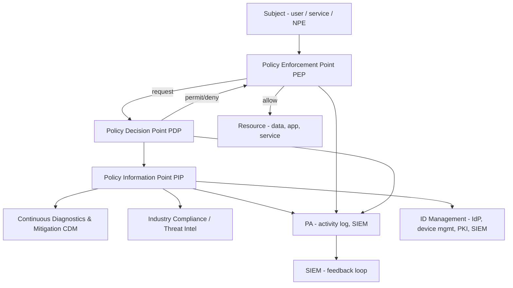

# Zero Trust Architecture (NIST SP 800-207)

## Feynman Explanation

The old model of security is a **castle-and-moat**: a strong firewall on the edge, and once you're inside, you're trusted. That model collapsed when employees went home with laptops, when SaaS moved the work outside the firewall, when contractors and partners needed access, and when attackers learned to log in as legitimate users. **Zero Trust** is the opposite: assume the network is already hostile, and for *every single request* — by a user, by a service, by a device — verify who they are, what device they are on, what they want, and whether that combination is allowed *right now*. The key insight is that "trust" is no longer a one-time passport stamp at the door; it is a per-decision judgment that the policy engine makes continuously.

## Technical Details

### 1. NIST SP 800-207 Core Tenets

| # | Tenet (verbatim) | What it means |
|---|---|---|
| 1 | All data sources and computing services are considered resources. | A network share, an API, a database row, a SaaS — all are "resources" subject to ZT policy |
| 2 | All communication is secured regardless of network location. | mTLS everywhere; no implicit trust based on subnet |
| 3 | Access to individual enterprise resources is granted on a per-session, per-request basis. | No "log in once, roam the inside" |
| 4 | Access to resources is determined by dynamic policy. | Policy = identity + device + context + behavior + risk |
| 5 | The enterprise monitors and measures the integrity and security posture of all owned and associated assets. | Device posture is a first-class input |
| 6 | All resource authentication and authorization are dynamic and strictly enforced before access is granted. | No implicit trust on session resumption |
| 7 | The enterprise collects as much information as possible about the current state of assets, network infrastructure, and communications and uses it to improve its security posture. | Telemetry → ML → better policy |

### 2. The Logical Components (NIST 800-207 §3)



| Component | Role | Example |
|---|---|---|
| **Subject** | The user / service / non-person entity making a request | Employee, contractor, service account, IoT device |
| **Resource** | The thing being accessed | Web app, database, API, file share, SaaS |
| **Policy Enforcement Point (PEP)** | The chokepoint that intercepts the request, asks the PDP, and enforces the decision | ZTNA gateway, API gateway, sidecar, IAM evaluation |
| **Policy Decision Point (PDP)** | The brain; evaluates the policy against attributes and returns permit/deny | OPA, AWS IAM, Azure AD Conditional Access, Cloudflare Access |
| **Policy Information Point (PIP)** | The data source the PDP consults | IdP, MDM, EDR, geo-IP, threat intel, UEBA |
| **Policy Administrator (PA)** | The orchestrator that issues the decision to the PEP, opens / closes the connection, and logs | Often combined with PDP; e.g., Cloudflare Access, Okta + OPA |
| **CDM** | Continuous diagnostics of device posture | MDM, EDR, vulnerability scanner |
| **Industry compliance** | Regulatory inputs to policy (e.g., GDPR, HIPAA) | Tagged resources, compliance metadata |
| **Threat intel** | Known-bad IPs, current campaigns | Firehol, OTX, MISP feeds |
| **Activity log** | Per-decision audit | SIEM |

### 3. The Core-Abstractions Model (NIST 800-207 §3.1)

A ZT request flows:

```
Subject ─── request ──▶ [PEP] ─── forward request + attributes ──▶ [PDP]
                          │                                              │
                          │                                              ▼
                          │                              [PIP]  fetch attributes from
                          │                              [CDM, IAM, IDMgmt, SIEM, Threat Intel]
                          │                                              │
                          │                                              ▼
                          │                                    permit / deny / step-up
                          │                                              │
                          ◀───────── decision + obligations ──────────────┘
                          │
                          ▼
                     resource (or denied)
```

The PDP returns a decision that may include **obligations** (e.g., "permit only if MFA was performed within the last 4 hours"; "permit only if device is compliant AND geo = US").

### 4. Trust Algorithm (NIST 800-207 §3.2 — formal-ish)

A ZT policy is a function:

$$\text{decision}(s, a, r) = f(\text{attrs}(s), \text{attrs}(a), \text{attrs}(r), \text{attrs}(e), \text{policy})$$

- $s$ = subject
- $a$ = action (read, write, exec, delete, …)
- $r$ = resource
- $\text{attrs}(\cdot)$ = current attributes (identity, device, location, behavior, time, risk score)
- $\text{policy}$ = the rule set (e.g., OPA Rego, Cedar, AWS IAM policy + SCP)

In a typical ZTNA gateway, the policy includes:

- Is the user authenticated with **phishing-resistant MFA**?
- Is the device **managed, encrypted, EDR-on, post-MDM-checked**?
- Is the **geo** in the allowed set?
- Is the **risk score** below the threshold?
- Is the **time** in the allowed window?
- Does the **resource sensitivity** allow this action?
- Is the **request** to a sensitive resource? If yes, **step up** (re-auth with stronger factor).

The decision is evaluated **on every request**, not just at session start.

### 5. BeyondCorp — Google's Reference Model

Google published the seminal ZT architecture in 2014 (the "BeyondCorp" papers).

| Layer | BeyondCorp component |
|---|---|
| Identity | Single sign-on, strong auth, all in one IdP |
| Device inventory | Real-time device database; trust is per-device |
| Access proxy | All internal apps are accessed through an **access proxy**; the user never reaches the app directly |
| Trust tier | Devices are tiered (managed vs unmanaged); access is granted by tier + identity + context |
| User-facing | Employees access internal apps from any device on any network — no VPN |
| Encryption | mTLS to the access proxy; per-request authorization |

#### BeyondCorp data flow

```
User device (with device certificate) → BeyondCorp access proxy
                                          │
                                          ├── device-trust check (certificate + posture)
                                          ├── identity check (SSO)
                                          ├── context check (geo, time, risk)
                                          │
                                          ▼
                                        Permit / deny
                                          │
                                          ▼
                                    Internal app (mTLS, per-request authz)
```

### 6. SDP — Software-Defined Perimeter (CSA)

The **Cloud Security Alliance (CSA)** SDP model is a closely related ZT pattern:

1. **SPA** (Single Packet Authorization) — the client must send a SPA packet to the controller; if accepted, the controller opens the gateway to that client.
2. The default network state is "no packets reach the application." The gateway accepts only authorized clients.
3. The user/device proves identity, the controller verifies, the gateway opens a 1:1 micro-tunnel.
4. **No VPN**, no implicit network trust, no broadcast.

**Vendors:** Cisco (Duo + Tetration), Cloudflare Access, Zscaler ZPA, Appgate SDP, Microsoft Entra Private Access (formerly Azure AD App Proxy evolved), Twingate, Tailscale + headscale (WireGuard), Tailscale Funnel, NetFoundry.

### 7. Microsegmentation

**Definition:** break the network into small, per-workload trust zones; enforce policy between every zone.

| Layer | Mechanism |
|---|---|
| **L3 / L4** | Host firewall (iptables, nftables, Windows Defender Firewall), cloud security group / NACL |
| **L7** | Service mesh (Istio, Linkerd, Consul Connect) sidecar policy, Envoy |
| **Identity** | mTLS workload identity (SPIFFE / SPIRE), workload certs per pod |
| **Cloud-native** | Kubernetes NetworkPolicy, Cilium, Calico |
| **Data center** | VMware NSX, Cisco Tetration, Illumio |

#### Microsegmentation policy example (Istio / Kubernetes)

```yaml
apiVersion: security.istio.io/v1beta1
kind: AuthorizationPolicy
metadata:
  name: allow-orders-to-payments
  namespace: payments
spec:
  selector:
    matchLabels:
      app: payments
  rules:
    - from:
        - source:
            principals: ["cluster.local/ns/orders/sa/orders-sa"]
      to:
        - operation:
            methods: ["POST"]
            paths: ["/charge"]
```

Effect: only the `orders` service account in the `orders` namespace can `POST` to the `payments` service. The compromise of any other workload cannot reach payments.

### 8. Continuous Verification (the per-request piece)

Traditional auth: log in once, get a session cookie, trust it for 8 h.

ZT continuous verification: every request re-evaluates identity, device, and risk; on a risk signal change, force **re-authentication** or **step-up**.

| Signal source | Re-evaluation example |
|---|---|
| **EDR** | Device falls out of compliance → step-up |
| **UEBA** | Same session starts downloading at 10× baseline → force re-auth |
| **Geo / IP** | IP changes mid-session (impossible travel) → terminate |
| **Threat intel** | Resource is now associated with a known-bad campaign → block |
| **Time** | Resource only available 09:00-18:00 → re-evaluate |
| **Step-up to sensitive action** | "Approve wire transfer" → require FIDO2 again |

### 9. ZT Mapping to Other Models

| ZT element | Maps to |
|---|---|
| Per-request authorization | ABAC (see L2 [[authorization-models]]) |
| Device posture input | PIP / CDM |
| PDP / PEP | ABAC reference architecture |
| Continuous verification | BeyondCorp, SDP |
| Microsegmentation | Network policy as a ZT input |
| JIT for admin | PAM (see L3 [[privileged-access-management-pam]]) |
| Federation | OIDC / SAML for identity (see L2 [[federation-sso-and-saml-oidc]]) |
| Phishing-resistant MFA | FIDO2 / passkey (see L3 [[multi-factor-authentication-mfa]]) |
| Service-to-service identity | SPIFFE / SPIRE, OIDC workload identity |

### 10. Zero Trust Maturity Model (CISA / NIST)

| Stage | Name | Defining characteristic |
|---|---|---|
| 0 | Traditional | Perimeter firewall; implicit trust inside |
| 1 | Initial | MFA on some apps; some asset inventory; basic device compliance |
| 2 | Advanced | Centralized IdP, MDM, conditional access, ZTNA for some apps, microsegmentation for crown jewels |
| 3 | Optimal | ZT everywhere; continuous verification; SPIFFE workload identity; policy-as-code; no standing access |

CISA's Zero Trust Maturity Model v2.0 (2023) expands each pillar (Identity, Devices, Networks, Applications & Workloads, Data, Visibility & Analytics, Automation & Orchestration, Governance) into Traditional / Initial / Advanced / Optimal.

### 11. ZT Architecture Pillars (CISA 5-pillar model)

| Pillar | What it covers |
|---|---|
| **Identity** | Strong auth, IdP, JIT, phishing-resistant MFA |
| **Devices** | MDM, EDR, device posture, certificate-based identity |
| **Networks** | Microsegmentation, mTLS, SDP, encryption in transit |
| **Applications & Workloads** | App-layer policy, service mesh, ABAC, secrets in workload identity |
| **Data** | Classification, encryption at rest, DLP, ABAC on data tags |

CISA 2.0 adds: **Visibility & Analytics, Automation & Orchestration, Governance**.

### 12. Common ZT Reference Deployments

| Reference | Architecture |
|---|---|
| **Google BeyondCorp** | Access proxy; device cert; per-request authz; no VPN |
| **CSA SDP** | Controller-gateway; SPA; identity-aware micro-tunnel |
| **NIST 800-207** | Conceptual / abstract; PEP / PDP / PIP |
| **NIST 800-207A** | Zero Trust Architecture for the Federal Government (concrete ABAC pattern) |
| **NIST SP 800-204D** | Strategies for the Migration to ZT |
| **DISA Zero Trust Reference Architecture** (US DoD) | Maps to DoD network |
| **CISA Zero Trust Maturity Model v2.0** | Maturity / 5 pillars |
| **Microsoft Zero Trust** | Conditional Access + Entra Private Access + Defender XDR |
| **AWS Zero Trust** | IAM + VPC + PrivateLink + IAM Identity Center + Verified Permissions |
| **Cloudflare Access / Zscaler ZPA / Twingate / NetFoundry** | ZTNA-as-a-service |

### 13. ZT Adoption Pitfalls (CISO lessons)

| Pitfall | Fix |
|---|---|
| "ZT means no firewall" — wrong | ZT *complements* the perimeter; it does not replace the first packet filter |
| "ZT means VPN is dead" — oversimplification | VPN can survive for legacy and admin; ZTNA replaces VPN for user→app |
| "ZT means no trust on the network" — naive | The network is still a layer; mTLS is the trust primitive |
| "ZT is a product" — wrong | ZT is an *architecture*; products are pieces of it |
| "ZT can be done in 6 months" — wrong | Multi-year program; identity first, then network, then apps, then data |
| "ZT = MFA" — incomplete | MFA is one input to ZT; device posture, context, risk are others |
| "ZT = microsegmentation" — incomplete | Microseg is one pillar; you still need identity, app, data |
| "ZT = no standing privilege" — true in spirit, hard in practice | JIT is the goal; some standing privilege is acceptable for break-glass |

### 14. ZT and Compliance

| Standard | ZT alignment |
|---|---|
| **NIST 800-207** | The ZT reference |
| **NIST 800-207A** | ZT for US federal |
| **CISA ZTMM v2.0** | Maturity model for US federal |
| **NIST 800-204D** | Migration strategies |
| **DoD Zero Trust Reference Architecture v2.0** | DoD-specific |
| **Executive Order 14028** (US, 2021) | Mandates ZT for federal agencies |
| **NIST 800-53 Rev. 5** | AC, IA, SC controls align with ZT (e.g., AC-2(11), IA-2, SC-8) |
| **NIST CSF 2.0** | The "GOVERN" function + "PROTECT" / "DETECT" map to ZT pillars |
| **ISO 27001:2022** | A.5.15, A.5.16, A.8.1, A.8.5, A.8.21 all align |
| **PCI-DSS 4.0** | Req 7-8 align; ZT is the architecture to meet them |
| **HIPAA Security Rule** | 164.308, 164.312 align; ZT is the technical safeguard |
| **GDPR Art. 32** | "Appropriate technical measures" — ZT reduces data exposure |
| **NYDFS, DORA, NIS2** | All require ZT-aligned controls |

### 15. ZT Service-to-Service (workload identity)

The hardest part of ZT is **non-person entities (NPEs)** — services talking to services. SPIFFE / SPIRE is the de-facto standard:

| Concept | Definition |
|---|---|
| **SPIFFE ID** | A URI-formatted identity for a workload: `spiffe://example.com/ns/payments/sa/payments-sa` |
| **SVID** | A SPIFFE-Verifiable Identity Document (an X.509 cert or JWT) the workload presents |
| **SPIRE** | The implementation that issues and rotates SVIDs |
| **Workload identity federation** | Cloud-native (AWS IAM Roles Anywhere, GCP Workload Identity Federation, Azure Managed Identity) — workload presents OIDC token from its IdP (e.g., GHA, K8s) to the cloud; cloud issues short-lived creds |

Effect: a workload in cluster A authenticates to a workload in cluster B with mTLS using SVIDs; both sides validated the cert against a SPIFFE trust bundle; no static keys, no shared secrets.

### 16. ZT — the Practical Roadmap

A reasonable 2-3 year roadmap, ordered by leverage:

1. **Identity:** phishing-resistant MFA (FIDO2 / passkeys) for all users; PIM / JIT for cloud admin; break-glass + monitoring.
2. **Devices:** MDM, EDR, certificate-based device identity.
3. **Visibility:** SIEM + UEBA + identity-event monitoring.
4. **ZTNA:** replace VPN with ZTNA for user→app access to crown-jewel apps.
5. **Microsegmentation:** start with Tier-0 (DC, identity Provider, payment systems).
6. **Workload identity:** SPIFFE / SPIRE for service-to-service.
7. **Policy-as-code:** OPA / Cedar; CI gates on policy.
8. **Data:** classify data; ABAC on data tags; DLP on egress.
9. **Continuous verification:** step-up on risk signal; auto-revoke on anomaly.
10. **Audit:** prove ZT for regulator, board, insurance.

### 17. Exam Pattern Recap

- **"ZT tenets"** — 7 tenets from NIST 800-207.
- **"PEP"** — intercepts and enforces.
- **"PDP"** — decides.
- **"PIP"** — feeds attributes.
- **"Per-request authorization"** — the core of ZT.
- **"BeyondCorp"** — Google's ZT; no VPN; per-request; access proxy.
- **"SDP"** — controller-gateway; SPA; default-deny network.
- **"Microsegmentation"** — small zones, mTLS between, policy-as-code.
- **"Continuous verification"** — re-evaluate on every request.
- **"SPIFFE"** — workload identity.
- **"ZTNA"** — ZT-style user→app access; replaces VPN.
- **"Risk signal"** — device, geo, time, behavior, threat intel.
- **"Step-up"** — re-auth with stronger factor on sensitive action.
- **"Phishing-resistant MFA is a ZT input, not the whole ZT."**

## CISO / Risk Manager View

Zero Trust is the **architectural** answer to a question every CISO has been asked for the last five years: "If the attacker is already inside, how do we stop them?" The board-level answer is: **never trust the network, always verify the request, shrink the blast radius**.

| Investment | What it buys | Time to deploy |
|---|---|---|
| **Phishing-resistant MFA for all staff** | Closes the front door; the foundation of ZT | 1-2 years |
| **MDM + device posture** | Devices are first-class; unmanaged = denied | 1-2 years |
| **ZTNA replacing VPN** | Removes the implicit-trust tunnel; per-request authz | 1-2 years |
| **Microsegmentation of Tier-0** | Stops lateral movement to the crown jewels | 1-2 years |
| **PIM / JIT for cloud admin** | No standing cloud Owner | 1-2 quarters |
| **SPIFFE for service-to-service** | Replaces static service-account keys | 1-2 years |
| **UEBA-driven continuous verification** | Re-evaluates risk per request | 1-2 years |
| **Policy-as-code (OPA, Cedar)** | Auditable, testable, versioned policy | 1-2 quarters |
| **Identity-aware DLP** | ABAC on data tags; policy follows the data | 1-2 years |
| **M&A day-one ZT** | Acquired-company integration without re-IP-ing or re-VPNing | Day 1 |

**Maturity ladder (ZT-specific, CISA ZTMM-aligned):**

| Stage | Name | Defining characteristic |
|---|---|---|
| 0 | Traditional | Perimeter-only; implicit trust; static credentials |
| 1 | Initial | MFA, basic MDM, some conditional access, partial inventory |
| 2 | Advanced | Phishing-resistant MFA, MDM coverage, ZTNA for crown-jewels, microsegmentation in places, policy-as-code for some |
| 3 | Optimal | ZT everywhere, continuous verification, SPIFFE workload identity, policy-as-code, data-ABAC, no standing access, near-real-time UEBA-driven re-eval |

**The board narrative:** "Zero Trust is not a product. It is an architecture that says: never trust the network, always verify the request. We have reduced our blast radius by X% over the next two years through identity, device, network, and application controls. This is the same journey the US Federal government is on under Executive Order 14028."

**Privileged risk concentration in ZT:** the **policy engine (PDP)** becomes the new crown jewel. Compromise of the PDP = compromise of every decision. The PDP must be:
- Redundant and highly available
- Integrity-protected (signed policies, signed decisions)
- Auditable (every decision logged)
- Tested (chaos engineering on the PDP)
- Versioned (policy-as-code in Git)
- Least-privileged (the PDP should not have standing access to the resources it protects)

**Compliance hooks:** see §14.

**Insurance and audit:** most cyber-insurance underwriters and SOC 2 / ISO 27001 / FedRAMP auditors now ask for evidence of ZT-aligned controls: phishing-resistant MFA, microsegmentation, JIT, encryption in transit, continuous monitoring. ZT is the architectural pattern that satisfies all of them at once.

**The single biggest mistake:** treating ZT as a product (buy ZTNA, done) instead of a multi-year program. ZT is a journey; CISA's 5-pillar model exists precisely to make the journey plan-able.

## Related Connections

### Sibling L3
- [[kerberos-protocol-deep-dive]] - ZT assumes Kerberos can be abused; least-priv + AES reduces risk
- [[multi-factor-authentication-mfa]] - Phishing-resistant MFA is the front door of ZT
- [[privileged-access-management-pam]] - JIT for admin is the ZT-Privileged-Access piece

### Cross-Domain
- [[domain-01-security-and-risk-management]] - ZT is the architecture chosen by the risk register
- [[domain-03-security-architecture-and-engineering]] - Reference monitor, TCB, secure boot, TPM
- [[domain-04-communication-and-network-security]] - mTLS, 802.1X, microsegmentation, SDP
- [[domain-07-security-operations]] - SIEM, UEBA, IR playbooks for ZT incidents
- [[domain-08-software-development-security]] - Policy-as-code, OPA in the app, secrets in the workload

## Sources / References

- NIST SP 800-207 - Zero Trust Architecture (Rose, Borchert, Mitchell, Connelly, 2020)
- NIST SP 800-207A - Zero Trust Architecture for the Federal Government (2022)
- NIST SP 800-204D - Strategies for the Migration to Zero Trust (2022)
- NIST SP 800-226 - Guidelines for Evaluating Zero Trust Architecture (draft 2024)
- CISA Zero Trust Maturity Model v2.0 (2023)
- CISA - "Zero Trust Architecture: An Overview" (2022)
- Google BeyondCorp papers (2014, 2017, 2019)
- CSA (Cloud Security Alliance) - Software-Defined Perimeter (SDP) Specification v2.0
- US Executive Order 14028 - "Improving the Nation's Cybersecurity" (2021)
- US OMB M-22-09 - Federal Zero Trust Strategy (2022)
- US DoD Zero Trust Reference Architecture v2.0 (2023)
- Microsoft Zero Trust Architecture documentation
- Cloudflare Zero Trust documentation
- Zscaler ZPA / ZDX documentation
- SPIFFE / SPIRE project documentation
- NIST CSF 2.0 (2024)
- OWASP Zero Trust Cheat Sheet
- (ISC)² CISSP CBK 2024 - Domain 5.9
