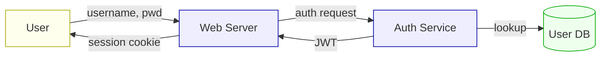

# Threat Modeling — STRIDE and PASTA

## Feynman Explanation

An architect does not pour concrete and then ask "could this collapse?" — they ask *before* drawing, on paper, with diagrams and worst-case scenarios. **Threat modeling is the architect's safety analysis applied to software.** You draw a picture of the system (data-flow diagram), then you systematically ask: "If I were an attacker, what could I break, spoof, tamper with, repudiate, leak, deny, or elevate into?" STRIDE is the checklist of attack categories; PASTA is the seven-step process that walks you from business objectives to prioritized mitigations. The output is a list of prioritized threats — not a guarantee, but a budget for where to spend design-time security effort.

## Technical Details

### Data-Flow Diagram (DFD) — The Required Input

Every threat model starts with a DFD. The four elements:

| Symbol | Element | Trust Implication |
|---|---|---|
| Rectangle | **External entity** (user, third-party API) | Outside the trust boundary |
| Circle | **Process** (service, function, microservice) | Inside; may handle data |
| Two parallel lines | **Data store** (DB, queue, blob) | Persistence = a control surface |
| Arrow | **Data flow** | Movement across a boundary = injection risk |



The **trust boundaries** are where arrows cross from one domain (browser → server, server → DB) — every boundary is a control point.

### STRIDE — The Six (Seven) Threat Categories

Developed at Microsoft (Loren Kohnfelder, 1999), applied per element of the DFD:

| Category | Question | Defeats By |
|---|---|---|
| **S — Spoofing** | Can an attacker pretend to be someone else? | Strong authN, MFA, certificates (D5) |
| **T — Tampering** | Can data be modified in transit or at rest? | Integrity (HMAC, signatures, TLS, DB constraints) |
| **R — Repudiation** | Can a user deny performing an action? | Tamper-evident audit logs, non-repudiation, signed events |
| **I — Information Disclosure** | Can data leak to unauthorized parties? | Encryption, access control, data classification (D2) |
| **D — Denial of Service** | Can the system be made unavailable? | Rate limiting, capacity, redundancy (D7) |
| **E — Elevation of Privilege** | Can a user gain unauthorized capabilities? | Least privilege, input validation, server-side authZ (D5) |

Some variants split **Tampering** and add **Lateral Movement** — for modern microservice architectures, treat *Elevation of Privilege* as the canonical E.

### STRIDE Applied Per DFD Element

| Element | S | T | R | I | D | E |
|---|---|---|---|---|---|---|
| **External entity** (user) | ✓ | | ✓ | | | |
| **Process** (service) | ✓ | ✓ | ✓ | ✓ | ✓ | ✓ |
| **Data store** (DB) | | ✓ | ✓ | ✓ | ✓ | ✓ |
| **Data flow** (arrow) | ✓ | ✓ | | ✓ | ✓ | |

> **The mnemonic.** "STRIDE" = "Spoofing of user identities, Tampering with data, Repudiation, Information disclosure, Denial of service, Elevation of privileges." For each DFD element, ask each of the questions that apply.

### PASTA — Process for Attack Simulation and Threat Analysis

PASTA is a 7-stage, **risk-centric** framework. It links business objectives to technical mitigations via attacker-centric simulation.

| Stage | Output | Tools |
|---|---|---|
| **1. Define business objectives** | Compliance scope, business risk appetite | Risk register (D1), regulatory mapping |
| **2. Define technical scope** | DFD, app boundaries, dependencies, trust zones | DFD tools, CMDB |
| **3. App decomposition** | Identified entry points, assets, trust boundaries | DFD + data classification (D2) |
| **4. Threat analysis** | Threat intelligence, attacker profile, threat types | MITRE ATT&CK, threat intel feeds |
| **5. Vulnerability analysis** | Existing controls, known weaknesses, design flaws | SAST, DAST, threat intel DBs |
| **6. Attack modeling** | Attack trees, attack scenarios, exploit chains | Attack trees, abuse cases, kill chains |
| **7. Risk & impact analysis** | Residual risk, prioritized countermeasures | ALE / SLE (D1), CVSS, business impact |

> **When to use PASTA over STRIDE.** STRIDE is fast (one-day workshop per feature) and design-time. PASTA is slower (weeks, suitable for annual program review or major redesigns) and produces a **business-justified** risk register that maps to ALE.

### Attack Trees

A tree where the root is the attacker's goal and the leaves are concrete attack steps. **OR nodes** = alternatives, **AND nodes** = required steps. Used in stage 6 of PASTA.

```
Goal: Steal customer PII
├── OR
│   ├── Compromise the database
│   │   ├── AND
│   │   │   ├── SQLi in the search API
│   │   │   └── WAF bypass / blind SQLi
│   │   └── OR
│   │       ├── Exfiltrate via backup volume
│   │       └── Use stolen cloud IAM credentials
│   ├── Compromise the application server
│   │   ├── RCE via dependency vulnerability
│   │   └── SSRF to internal metadata service
│   └── Compromise a privileged user
│       ├── Phish an admin
│       └── Session hijack
```

Each leaf has a **cost** (difficulty, $), **probability**, and **impact**; the tree is evaluated bottom-up to rank mitigations.

### Abuse Cases

Abuse cases are the inverse of use cases. They start from the question "How could this feature be used to cause harm?" and are typically written in the same template (Actor + Pre-condition + Trigger + Flow + Post-condition).

**Normal use case:** "Authenticated user retrieves their own order history."

**Abuse case:** "Anonymous attacker enumerates order IDs (BOLA — Broken Object Level Authorization, OWASP API #1) by iterating `/orders/{id}` and reading other users' PII."

The abuse case drives a new requirement: server-side enforcement that the order's `user_id` matches the session's `user_id`. (See [[api-security-and-microservices]].)

### STRIDE Practical Workflow (One-Day Workshop)

1. **Scope** — pick a feature, not a system. (e.g., "password reset")
2. **DFD** — draw it in 30 min. Identify 2–4 trust boundaries.
3. **Brainstorm STRIDE per element** — 90 min. Generate 15–40 threats.
4. **Prioritize** — DREAD or CVSS; rank top 10.
5. **Mitigations** — for each, assign an owner, a control, a verification.
6. **Output** — one-page "threat model" attached to the design doc.

### DREAD (Legacy Scoring)

| Letter | Question | Range |
|---|---|---|
| **D**amage | How bad is the impact? | 1–10 |
| **R**eproducibility | How reliably can it be reproduced? | 1–10 |
| **E**xploitability | How easy is exploitation? | 1–10 |
| **A**ffected users | How many users are affected? | 1–10 |
| **D**iscoverability | How easy is it to find? | 1–10 |

$$\text{DREAD score} = \frac{D + R + E + A + D_{\text{disc}}}{5}$$

> **Note.** Microsoft deprecated DREAD in 2008 in favor of CVSS v3.1, but DREAD remains on the CISSP exam as the canonical mnemonic.

### Comparison of Methods

| Method | Granularity | Time | Audience | Output |
|---|---|---|---|---|
| **STRIDE** | Per DFD element | Hours–1 day | Engineering | Threat list, mitigations |
| **PASTA** | Business → tech | 1–4 weeks | Eng + Risk + Business | Risk register, prioritized mitigations |
| **Attack Trees** | Per goal | 1–2 days | Engineering + SecOps | Tree of attack paths, cost/risk |
| **VAST (Visual, Agile, Simple Threat)** | Per user story | Story-point cost | Agile teams | Threat model per story |
| **LINDDUN** | Privacy-specific | Days | Privacy eng | Privacy threat catalog |
| **TRIKE** | Risk-based, permissions | Days | SecOps | Permission matrix + threats |

### Threat Modeling in Agile / DevSecOps

Threat models must be **lightweight enough to live in the sprint**. Patterns that work:

- **STRIDE-per-PR**: a 30-minute whiteboard session for any new endpoint or trust boundary change.
- **Abuse-case-driven**: write the abuse case in the same story as the use case.
- **"Threat model as code"**: threat model stored in `/threat-models/<feature>.yaml`, reviewed in PR.
- **LINDDUN for personal data**: triggered automatically when a story touches PII/PHI fields.

### Common Anti-Patterns

1. **One-time, system-wide, six-month threat model** that goes stale immediately. Threat models must be per-feature and live with the code.
2. **STRIDE without mitigations** — generating threats but not assigning owners.
3. **DREAD/PASTA scores without context** — over-weighting "excitement" or attacker skill.
4. **Confusing threat *modeling* with risk *assessment*** — modeling produces threats; assessment ranks them.
5. **Skipping trust boundaries** — if your DFD has no boundaries, you have not drawn a threat model, you have drawn a system diagram.

## CISO / Risk Manager View

**Board framing.** Threat modeling is the **highest-leverage dollar in software security**. The data is consistent: teams that threat-model new features find and fix design flaws at a fraction of the cost of finding them post-release. Boards care about *predictability of security outcomes*; threat modeling turns "we'll pentest at the end" into "we designed out 80% of the obvious flaws."

**Strategic priorities.**

1. **Make threat modeling a release gate.** A feature cannot ship without a threat model attached to the design doc. Bake it into the Definition of Done.
2. **Train every senior engineer in STRIDE.** A 1-day workshop scales to thousands of threat models per year. The cost-per-finding drops 10× versus pentest.
3. **Use PASTA for the annual security review.** A 2-week exercise per major product produces a board-defensible risk register.
4. **Adopt "threat model as code"** — a YAML/JSON threat model in the repo is reviewable, version-controlled, and survives staff turnover.
5. **Tie threat model output to the risk register.** Each unmitigated threat becomes a D1 risk entry with an owner and a date.

**Metrics the board cares about.**

- % of new features with a threat model (target: 100%)
- # of design flaws caught pre-merge vs. post-release (target: $\geq 5\times$ ratio)
- Mean age of an unmitigated high-priority threat (target: $\leq 30$ days)
- Threat-model coverage of customer-facing services (target: 100%)

## Related Connections

### Sibling L2
- [[sdlc-models-and-security-integration]] — STRIDE lives in the design phase
- [[secure-coding-practices-owasp]] — the rules that defeat the threats identified here
- [[api-security-and-microservices]] — APIs are the dominant modern attack surface for threat modeling

### L3 Standards
- [[software-supply-chain-attacks-slsa]] — threat modeling must include the build pipeline
- (No direct L3 child; threat modeling is a process, not a framework)

### Cross-Domain
- [[../Domain-01-Security-and-Risk-Management/risk-management-framework]] — DREAD/CVSS feed D1 risk register
- [[../Domain-05-Identity-and-Access-Management/Domain-05-Index]] — S and E categories are D5 controls
- [[../Domain-06-Security-Assessment-and-Testing/Domain-06-Index]] — pentest validates the threat model

## References

- Shostack, A. — *Threat Modeling: Designing for Security* (Wiley, 2014)
- Microsoft — *The STRIDE Threat Model* (2009); *SDL Threat Modeling Tool* documentation
- Tony UcedaVélez, Marco Morana — *Risk Centric Threat Modeling* (Wiley, 2015) — PASTA origin
- OWASP — *Threat Modeling Cheat Sheet*; *Application Threat Modeling* (2023)
- MITRE ATT&CK Framework
- NIST SP 800-154 (Draft) — Guide to Data-Centric System Threat Modeling
- CVSS v3.1 — Common Vulnerability Scoring System
- (ISC)² CISSP CBK — Domain 8: Software Development Security
